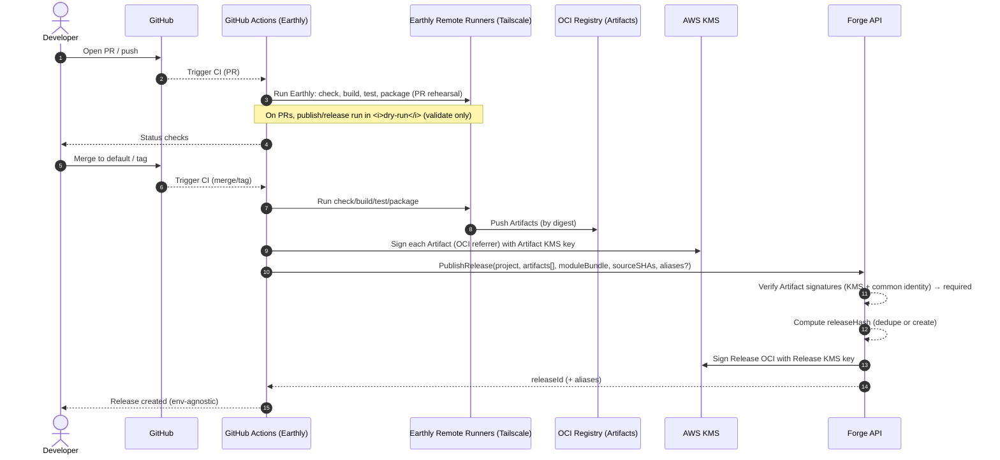
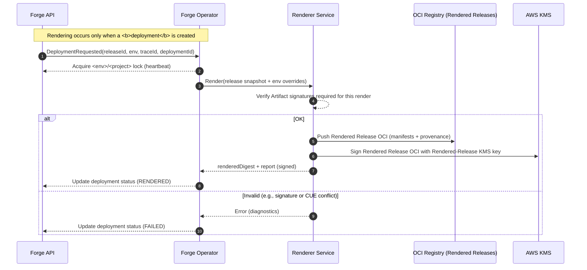

Perfect—thanks for the guidance. Below is **Part I: Conceptual (sections 1–4)** rewritten to be conversational and non‑technical. It’s designed to **create shared language** and **mental models** for PMs, leadership, QA, engineers, and platform/SRE—without leaking low‑level details. All file names, paths, and implementation specifics are saved for the Reference section.

---

# Part I — Conceptual

## 1) What is Catalyst Forge?

**Short preamble.**
Shipping software often feels like everyone building their own bridge across the same river. Each team invents a new CI pipeline, glues together deployments, and hopes it works the same way next time. It’s slow, fragile, and distracts from building the product.

**Catalyst Forge** puts rails under that journey. With a small, declarative “blueprint” and a few simple conventions, teams get a reliable path from **code → built → tested → released → running**—without hand‑crafting pipelines. Forge does the repetitive work, keeps the important decisions visible, and lets humans make the calls that matter (like promotions to pre‑prod and prod).

**What you can expect**

* **No bespoke CI per repo.** Teams use the same clear phases (check, build, test, package) with room for project‑specific steps when needed.
* **Releases you can talk about.** Every release has a unique ID and a friendly, speakable alias so we can reference it in meetings.
* **Promotion with guardrails.** Moving something to an environment is deliberate, auditable, and quick—QA approves dev→pre‑prod; SRE/Platform approves pre‑prod→prod.
* **Provenance you can trust.** Anything running in an environment can be traced back to the exact code, release, and approvals that put it there.

**What this version won’t try to do**

* Provision infrastructure like databases or caches.
* Offer full‑featured preview environments (we’ll start with limited support).
* Auto‑promote based on tests—promotions are consciously human‑approved.
* Auto‑create dashboards (we link to what SRE already manages).

**What success looks like (near‑term)**

* **Lower MTTR:** bugs identified, fixed, and shipped faster.
* **Higher developer productivity:** more time on product work, less on plumbing.
* **Happier teams:** better scores on our internal developer surveys.

---

## 2) Who uses Forge (personas & how they interact)

* **Product Manager**
  Wants predictable delivery and clarity on “what’s live.” Uses dashboards and release names to follow progress, ask questions, and plan launches.

* **Engineers (Application Developers)**
  Want to focus on features, not pipeline mechanics. They add a simple blueprint, push code, see their builds/tests run the same way every time, and can request promotions when they’re confident.

* **QA**
  Acts as the human gate between **dev → pre‑prod**. Approves when the change is ready for broader validation and records a short reason for the approval.

* **SRE / Platform Engineer** *(one combined role in our org)*
  Owns the platform, reliability, and the path into **prod**. Approves **pre‑prod → prod** promotions with a brief reason and performs a quick step‑up verification before giving the green light. Keeps the guardrails healthy and the system observable.

> **Shared language goal:** when we say “blueprint,” “release,” “promotion,” or “trace,” everyone knows what we mean.

---

## 3) Core concepts (the mental model)

* **Blueprint**
  A simple, declarative description of how your service should be built, tested, and deployed. Think of it as your service’s “instructions” to Forge.

* **Module**
  A building block used during deployment (for example, “render my Kubernetes manifests this way”). A **module bundle** is just “the set of modules” your service uses.

* **Artifact**
  The things we build (like container images). We always treat them as immutable “by‑digest” so we know exactly what we’re running.

* **Release**
  A point‑in‑time snapshot of your service—what was built and how it’s meant to run. It has a unique ID and a friendly alias so humans can refer to it easily. Releases are **environment‑agnostic**: the same release can be promoted to different places.

* **Rendered Release**
  The “ready‑to‑install” version of a release. It’s what actually gets applied to an environment after we add any environment‑specific tweaks.

* **Environment**
  Named places where software runs (dev, pre‑prod, prod). Each can apply **environment overrides**—settings that adapt a release to that place without changing the release itself.

* **Deployment**
  The act of taking a rendered release and applying it to an environment. If multiple deployment requests stack up, Forge makes sure the **newest decision wins** so environments don’t flip‑flop.

* **Promotion**
  A human action that moves a release forward (e.g., dev → pre‑prod → prod). Promotions are recorded with **who approved** and, for non‑dev environments, **why**.

* **GitOps (in plain English)**
  We change what runs by making a tracked change in a central repository. That change is reviewed, merged, and then applied. It means every deployment has a paper trail.

* **Trace**
  A unique ID carried end‑to‑end so anyone can answer, “What is running here and where did it come from?”

---

## 4) From commit to cluster (the story) — **revised**

**A friendly picture of the journey**

1. **You open a pull request.**
   Forge runs the **full pipeline**—checks, builds, packages, and tests—so you see exactly how things would behave. The “publish & release” steps run in **dry‑run mode** here: we validate everything, but we don’t create or change any official records yet. It’s a safe rehearsal.

2. **You merge (or tag) when it’s ready.**
   Forge creates a **Release**—a snapshot of what was built and how it’s meant to run.

   * If your service has **auto‑deploy to dev** turned on, Forge will immediately **create a deployment to dev** and (as part of that deployment) **render** the release for that environment.
   * If **auto‑deploy is off**, nothing rolls out yet; Forge waits for someone to request a deployment, and **rendering happens at that moment** for the chosen environment.

3. **You ask to promote.**
   When you’re confident, you request a **promotion** to an environment. Forge then **renders** the release for that specific place (applying its environment overrides) and proceeds.

   * **Dev → pre‑prod** needs a QA approval (with a short reason).
   * **Pre‑prod → prod** needs an SRE/Platform approval (with a short reason and a quick step‑up verification).

4. **Forge makes the change visible and safe.**
   Behind the scenes, Forge opens a small, focused change that tells our deployment system to use that rendered release. It’s reviewed automatically and merged if it passes our checks. This keeps a clean, auditable record of what changed and why.

5. **Your change rolls out.**
   The environment picks up that change and applies it. Everything it creates is stamped with a **trace** so you can follow the story back to the exact release and commit.

6. **If you need to roll back.**
   Promote a previous release. Forge makes the same safe, visible change to point back to the earlier snapshot—no mysteries, no manual surgery.

> **Note:** Auto‑deploy is **opt‑in per service**. You can start manual‑only and turn on auto‑deploy to dev later if it helps your workflow.


## 5) Day‑in‑the‑Life Scenarios

### “I merged code”—what happens?

**What you do:** Open a PR, iterate, and then merge (or tag) when it’s ready.
**What Forge does:**

* On PRs, it runs the *full* pipeline as a safe rehearsal—nothing official is created.
* On merge/tag, Forge creates a **Release** (the snapshot we can talk about and promote).
* If your service has **auto‑deploy to dev** turned on, Forge immediately starts a **deployment** to dev and renders the release for that environment. If not, it waits for someone to request a deployment.

**What you see:** A release with a unique ID and a friendly alias; clear status on whether it’s deployed anywhere yet.

---

### “I want to promote to pre‑prod/prod”

**What you do:** From the CLI or web, choose the **Release** and the target **environment** and request a **promotion**.
**What Forge does:**

* Renders the release *for that environment* (so the right settings apply).
* Requires a human approval: **QA** approves dev → pre‑prod; **SRE/Platform** approves pre‑prod → prod.
* For non‑dev environments, the approver must add a short **reason**. For prod, there’s a quick **step‑up** check before approval.
* Applies the change safely and records who did what and why.

**What you see:** A clear record of the promotion, a visible change request, and the environment moving to the selected release.

---

### “I need to roll back”

**What you do:** Pick an earlier **Release** and promote it to the environment.
**What Forge does:** Treats rollback like any other promotion—safe, visible, and auditable.
**What you see:** The environment rolls back cleanly, with the same paper trail and approvals.

---

### “I need to see why my change isn’t live”

**Quick checklist:**

1. **Was auto‑deploy to dev on?** If not, a deployment still needs to be requested.
2. **Is there a pending approval?** Promotions wait for QA/SRE sign‑off.
3. **Did the safety checks pass?** If not, the change will be held until they do.
4. **What does the trace show?** Use the **trace** to follow what’s running back to the exact release and commit.

**Outcome:** You can locate the bottleneck quickly—no guesswork.

---

## 6) Guardrails & Principles

* **Human‑in‑the‑loop for important moves**
  Promotions are deliberate. Non‑dev environments require a short **reason**, and prod adds a quick **step‑up** verification for the approver.

* **Immutability & clarity**
  Releases are snapshots you can point to. We never “silently change” what a release means. If we roll forward or back, you’ll see it.

* **Single source of truth**
  What runs in an environment is driven by a visible change in one place (our Git‑based deployment flow). That makes it easy to review, approve, and audit.

* **Newest decision wins**
  If multiple deploy requests stack up for the same place, Forge applies the **latest** one so environments don’t flip‑flop.

* **Convention over configuration**
  We standardize the core build/test/package phases and the deployment shape so teams spend less time on scaffolding—and still retain room to customize where it counts.

* **Simple environment overrides**
  Each environment can adapt a release with clear, values‑only overrides—no hidden forks or one‑off templates.

* **Use the right tools**
  We lean on proven systems (build, Git‑based deployment, cluster reconciler) rather than reinventing them, so teams get reliability without extra complexity.

---

## 7) What You Get Out‑of‑the‑Box

* **A smooth path from code to running**
  Standard pipeline phases; clear releases; simple promotions; safe rollbacks.

* **Developer ergonomics**
  A **CLI** for local tasks and a **web app** to browse releases, request/approve promotions, and see what’s live.

* **Automation that stays visible**
  Background services handle the heavy lifting (build, release, deploy) but always leave a readable trail of what changed and why.

* **Approvals & audit**
  Role‑based permissions, reasons required for non‑dev environments, quick step‑up checks for prod, and a clean audit history for every decision.

* **Provenance**
  A **trace** stamped on running things so anyone can answer, “What is this and where did it come from?”

* **Ecosystem fit**
  Works with our standard build/runtime tools and container registries, and uses a Git‑based deployment model (GitOps) so nothing is “magic.”

---

## 8) Limits & Non‑Goals (this version)


* **Infrastructure provisioning**
  Not in scope now (e.g., databases, caches). The long‑term vision is to attach infra as modular building blocks, but that will come later.

* **Preview/ephemeral environments**
  We’ll start with limited support. Full, automated previews are a future milestone.

* **Automated promotions**
  This release is **manual promotions only**. The platform lays groundwork for policy‑gated automation later.

* **Automatic dashboards**
  We don’t auto‑create observability dashboards. We’ll link to what SRE maintains today.

* **Deep customization everywhere**
  Forge is intentionally opinionated. You can opt out when needed—but the happy path should cover most cases without special work.

  Got it—thank you for the precise corrections. I’ve applied them and **reissued Part II, sections A–C** below. First, a 6‑line changelog so you can see exactly what changed, then the updated sections.

---

## Quick changelog (what I fixed)

1. **Remote Runner = Earthly Remote Runners** (BuildKit backends), reachable via **Tailscale** (not optional). Removed them as a Forge component; documented as an external dependency.
2. **OCI registries** now described in domain terms: store **Artifacts**, **Releases** (as OCI), and **Rendered Releases** (as OCI).
3. **Identity** now lists **Service Accounts** (for non‑GitHub systems) in addition to WebAuthn (humans) and GitHub OIDC (CI).
4. **Blueprint/Module/Module Bundle persistence** corrected: live in **Git**; not persisted as separate DB configs. The **Release OCI** carries the authoritative snapshot of the module bundle + inputs.
5. **Release SoR** clarified: **OCI is authoritative** (DB is an index/cache for query UX).
6. **`releaseHash`** updated to **exclude renderer version** (unknown at release time).

---

# Part II — Reference Architecture (Revised A–C)

## A) System Context & Dependencies

### A1. Context (C4‑L1)

**Primary actors**

* **Engineers (Devs)** — push code, open PRs, request promotions.
* **QA** — approves promotions to pre‑prod (records reason).
* **SRE/Platform** — approves promotions to prod (records reason + step‑up).

**Forge (the platform)**

* **Forge API** — system of record, auth/RBAC, locks, releases, promotions, events.
* **Forge Operator** — single writer to GitOps, orchestrates rendering & PRs.
* **Renderer Service** — gRPC renderer (release + env overrides → manifests packaged as OCI).
* **Web App** — approvals, visibility, provenance.
* **CLI (FORGE)** — local workflows, auth, blueprint evaluation, CI generator.

**External systems**

* **Git hosting & CI** — GitHub + GitHub Actions; GitHub **OIDC** to Forge.
* **OCI registries** — store **Artifacts**, **Releases** (OCI), and **Rendered Releases** (OCI).
* **GitOps** — Single Git repo; PR‑based updates; **Sigstore**‑signed by Forge bot.
* **Argo CD** — consumes pointer → fetches Rendered Release OCI → applies manifests.
* **Kubernetes clusters** — dev, pre‑prod, prod.
* **Secrets** — AWS Secrets Manager + External Secrets Operator.
* **Identity** — WebAuthn (humans), GitHub OIDC (CI), **Service Accounts** (non‑GitHub systems).
* **Network** — **Tailscale** (used to reach **Earthly Remote Runners** only).

**Key flows**

1. **PR** → CI performs full rehearsal (publish/release in *dry‑run*).
2. **Merge/Tag** → CI builds Artifacts, calls **Forge API** to **publish a Release** (dedup via `releaseHash`).
3. **Deployment** → **Operator** renders for a target environment (via Renderer), pushes **Rendered Release** (OCI), opens **PR** updating the pointer; PR auto‑merges on checks/signature; **Argo CD** syncs; cluster objects labeled/annotated with Trace & Release metadata.

---

### A2. Containers (C4‑L2)

**Forge API**

* Stateless HTTP/gRPC; owns DB (SoR for domain state except where noted), WebAuthn sessions, tokens (incl. OIDC exchange), RBAC, locks, promotions, events.

**Forge Operator** (single instance)

* Manages GitOps repo as **single writer**; enforces `<env>/<project>` lock; coordinates render; pushes Rendered Releases (OCI); opens PRs; supersedes older deployments; records GitOps events.

**Renderer Service**

* Stateless gRPC service; deterministic render from **Release + env overrides** → manifests; outputs **Rendered Release (OCI)** with provenance.

**Web App**

* UI for releases, approvals (reasons captured), rollbacks, and trace exploration.

**CLI (FORGE)**

* Local auth (device‑link to browser), blueprint eval (CUE), developer tasks, CI workflow generation.

**State & infra**

* **DB** — releases index, deployments, promotions, locks, events, users/sessions.
* **OCI registry** — **Artifacts**, **Releases** (authoritative), **Rendered Releases**.
* **GitOps repo** — per env/project: pointer + debug (human‑readable).
* **Argo CD** — reconciler.

*(Earthly Remote Runners are **external** and not a Forge component.)*

---

### A3. External dependency notes

* **Earthly Remote Runners** — remote **buildkitd** instances for Earthly; CI submits builds to them. Connectivity provided via **Tailscale**. Forge does not manage or schedule these runners; it integrates with CI that uses them.
* **Sigstore** — Forge bot uses keyless signing for GitOps PRs/commits.
* **Service Accounts** — for non‑GitHub external systems to authenticate to Forge (scoped tokens; coming online with the identity subsystem).

---

## B) Component Responsibilities & Interfaces

> Forge components only (external systems are documented in §A).

### B1. Forge API

**Responsibilities**

* Domain SoR (except: **Releases** are authoritative in OCI).
* AuthN: WebAuthn (humans), OIDC exchange (CI), Service Account tokens.
* RBAC & policy checks (who can promote where).
* **Release identity & idempotency** (`releaseHash`).
* **Locks** for `<env>/<project>` (heartbeat).
* Promotions & approvals (reasons for non‑dev; step‑up for prod).
* Audit/provenance, trace index, GitOps events.

**Interfaces**

* HTTP/gRPC: `PublishRelease`, `Get/ListReleases`, `RequestDeployment`, `ApprovePromotion`, `CancelDeployment`, `GetDeployment`, `GetTrace`, `ListGitOpsEvents`, `Auth*`.

**Failure modes & scaling**

* As previously specified (stateless; retries; TTL on locks).

---

### B2. Forge Operator

**Responsibilities**

* Single writer to GitOps; enforce `<env>/<project>` lock; supersede older deployments.
* Render (call Renderer) when deployment requested; push **Rendered Release (OCI)**.
* Open/update GitOps PRs; require Sigstore signature + policy checks before auto‑merge.
* Record GitOps Action/Change events; observe PRs → merge/close; expose final deployment status.

**Interfaces**

* API (locks, releases, deployments, events); Renderer gRPC; OCI push; Git host API.

**Failure modes & scaling**

* Refuse out‑of‑band changes by default; **break‑glass** documented.
* Single active instance; resumes via DB + Deployment CR after restart.

---

### B3. Renderer Service

**Responsibilities**

* Deterministic rendering from **Release (module bundle snapshot) + environment overrides**.
* Output **Rendered Release (OCI)**; attach provenance (releaseId, traceId, module versions, renderer version).
* Never embed secret material.

**Interfaces**

* gRPC `Render()` with inputs: `releaseId`, normalized bundle snapshot (from Release), env overrides; outputs OCI digest + validation report.

**Failure modes & scaling**

* Fail on CUE conflicts/invalid input; stateless, horizontally scalable.

---

### B4. Web App

**Responsibilities**

* Releases browse, “what’s live,” request/approve promotions (capture reasons), rollback, audit & trace.

**Interfaces / Scaling**

* As previously specified; stateless, horizontal.

---

### B5. CLI (FORGE)

**Responsibilities**

* Auth (device‑link), local blueprint eval (CUE), developer commands, CI workflow generation from `.forge/*`.

**Interfaces / Scaling**

* Client‑side; clear failure messages.

---

## C) Domain Model & Persistence

> **Authoritative sources vary by entity** (not always the DB). The table reflects that explicitly.

### C1. Entities (definitions, IDs, SoR, persistence)

| Entity                        | Purpose / Key fields                                                     | ID & Identity                                         | **Source of truth**     | Persistence                                  |
| ----------------------------- | ------------------------------------------------------------------------ | ----------------------------------------------------- | ----------------------- | -------------------------------------------- |
| **Repository**                | Links a VCS repo to Forge; onboarded settings (e.g., auto‑deploy to dev) | `repoId`                                              | DB                      | DB                                           |
| **Project**                   | Logical service in a repo; policies & defaults                           | `projectId`                                           | DB                      | DB                                           |
| **Blueprint**                 | Version‑controlled config (modules + values) **in Git**                  | path+commit                                           | **Git**                 | Git only (not stored as DB config)           |
| **Module / Module Bundle**    | Part of the Blueprint; captured **as a snapshot inside a Release**       | n/a (embedded)                                        | **Release OCI**         | In Release OCI (and surfaced in debug files) |
| **Artifact**                  | Built output (e.g., container image by digest)                           | digest                                                | **OCI registry**        | OCI (primary) + DB index                     |
| **Release**                   | Snapshot of artifacts + module bundle (+ source SHAs, metadata)          | `releaseId` (`app‑YYYYMMDDhhmmss`) + optional aliases | **OCI (Release image)** | OCI (authoritative) + DB (index / query UX)  |
| **Release Hash**              | Content hash across *all release inputs* (see below)                     | `releaseHash`                                         | DB (uniqueness)         | DB                                           |
| **Rendered Release**          | Env‑specific render of a Release (after overrides)                       | OCI digest; `(releaseId, env)`                        | **OCI registry**        | OCI (primary) + DB index                     |
| **Environment**               | Named env (dev/pre‑prod/prod), policies & overrides location             | `environmentId`                                       | DB                      | DB                                           |
| **Deployment**                | Request to apply a release to an environment; tracks PR & status         | `deploymentId`                                        | DB                      | DB + CR (for recovery)                       |
| **Promotion**                 | Approval record (who, when, **reason** for non‑dev; step‑up for prod)    | `promotionId`                                         | DB                      | DB                                           |
| **GitOps Action/Change/Sync** | Intent → commit/PR → reconciliation snapshots (Forge‑initiated only)     | ids                                                   | DB                      | DB                                           |
| **Trace**                     | Global provenance ID linking all artifacts of a change                   | `traceId` (UUIDv7)                                    | DB                      | DB                                           |
| **Lock**                      | Deployment lock for `<env>/<project>` with heartbeat/TTL                 | composite                                             | DB                      | DB (+ mirrored in Deployment CR)             |
| **Service Account**           | Non‑GitHub external identity with scoped credentials                     | `serviceAccountId`                                    | DB                      | DB                                           |

**Release hash (`releaseHash`)**

* Computed over a canonical, schema‑stable JSON of:

  * Ordered **artifact digests**;
  * **Module bundle snapshot** (module types/names/versions + normalized values);
  * **Source commit SHA(s)**;
  * *(Renderer version is **excluded** — not known at release time.)*
* Uniqueness: per project, `releaseHash` is unique. If a publish arrives with an existing `releaseHash`, API **reuses the existing Release** (returns same `releaseId`) and logs an additional attempt.

---

### C2. Identity & ordering rules

* **Release identity**: canonical `app‑YYYYMMDDhhmmss` (UTC). Aliases: optional semver, optional speakable slug (`word‑word‑###`), neither used as identity. **SoR = OCI**.
* **Rendered Release identity**: OCI digest; DB indexes by `(releaseId, environment)`.
* **Deployment ordering**: lock key `<env>/<project>`; **newer supersedes older**; older requests canceled.
* **Approvals**: Dev→pre‑prod requires QA (reason **required**). Pre‑prod→prod requires SRE/Platform (reason **required** + step‑up). Operator will not auto‑merge the PR without a valid promotion record.

---

### C3. Persistence map (revised)

* **DB (SoR for):** Repository, Project, Environment, Deployments, Promotions, GitOps events, Trace index, Locks, Users/Sessions, Service Accounts.
* **OCI registry (SoR for):** **Artifacts**, **Releases** (release images carrying the authoritative snapshot), **Rendered Releases**.
* **Git (GitOps repo):** env/project pointer (machine‑readable) + debug (human‑readable bundle snapshot).
* **Clusters:** runtime objects labeled/annotated for provenance; secrets bridged via External Secrets Operator from AWS SM.

---

### C4. Immutability & lifecycle

* **Releases**: immutable once published; dedup via `releaseHash`.
* **Rendered Releases**: immutable OCI artifacts (re‑render produces new digest).
* **Pointers**: changed only via PR; history is the deployment log.
* **Audits**: promotions/approvals append‑only with reasons for non‑dev.

---

# D) Workflows (Sequence Diagrams)

> The diagrams reflect: **Rendered Release is created only as part of a deployment** (manual or auto‑deploy‑to‑dev). CI uses **Earthly Remote Runners** over **Tailscale**.

## D1. CI phases (check / build / test / package)



---

## D2. Publish → Release creation (idempotent)

```mermaid
sequenceDiagram
    autonumber
    participant CI as CI
    participant API as Forge API
    participant REG as OCI Registry (Releases)
    participant KMS as AWS KMS

    CI->>API: PublishRelease(payload)
    API-->>API: Verify Artifact signatures (fail closed if invalid)
    API-->>API: Normalize module bundle; compute releaseHash
    alt Hash exists
        API-->>CI: 200 OK (existing releaseId; attempt logged)
    else New
        API->>REG: Push Release OCI (authoritative snapshot)
        API->>KMS: Sign Release OCI with Release KMS key
        API-->>API: Index in DB (releaseId, releaseHash, aliases, signed=true)
        API-->>CI: 201 Created (releaseId)
    end
```

**Release OCI (authoritative) includes:** artifacts (digests), module bundle snapshot (types/names/versions + normalized values), source SHAs, release metadata. *(Renderer version is not part of `releaseHash`.)*

---

## D3. Render (dry‑run vs OCI‑packaged)



*(Optional)* **dry‑run** render during PR rehearsals: validation/diff only; no OCI emitted.

---

## D4. Deployment → GitOps update → Argo Sync → status

```mermaid
sequenceDiagram
    autonumber
    actor QA as QA
    actor SRE as SRE/Platform
    participant UI as Web/CLI
    participant API as Forge API
    participant OP as Forge Operator
    participant GIT as GitOps Repo
    participant CMP as Argo CMP (Pointer→OCI)
    participant ARGO as Argo CD

    UI->>API: Request promotion (releaseId → env)
    API-->>API: RBAC/policy evaluation; capture required reason & step‑up (prod)

    API->>OP: DeploymentRequested(...)
    OP-->>API: Acquire <env>/<project> lock
    OP-->>OP: Verify Rendered Release signature (KMS identity & class)
    OP->>GIT: Open PR: update pointer + write debug file (Sigstore‑signed commit)
    OP-->>API: Record GitOps Action

    GIT-->>OP: Checks pass (schema, signature, policy); auto‑merge PR
    OP-->>API: Record GitOps Change (commit)

    ARGO-->>GIT: Detect change
    ARGO->>CMP: Dereference pointer → fetch Rendered Release OCI
    CMP-->>CMP: Verify Rendered Release signature (fail closed if invalid)
    ARGO->>ARGO: Apply manifests (only if signature validated)
    OP-->>API: Record GitOps Sync result
    API-->>UI: Deployment status = LIVE (or FAILED)
```

**Commit subject (default):**
`Deploy release <releaseId> for project <project> to the <env> environment.`

**Commit body (metadata):**

* traceId, deploymentId, release aliases, releaseHash
* rendered digest, renderer version
* policy decision (who/when/why), step‑up (if prod)

---

## D5. Rollback

```mermaid
sequenceDiagram
    autonumber
    actor User as Dev/QA/SRE
    participant API as Forge API
    participant OP as Forge Operator
    participant REN as Renderer
    participant GIT as GitOps Repo
    participant ARGO as Argo CD

    User->>API: Promote previous release to <env>
    API-->>API: Same approval rules (reason for non‑dev; step‑up for prod)
    API->>OP: DeploymentRequested(previous releaseId, env)
    OP->>REN: Render(previous release + env overrides)
    OP->>GIT: PR updates pointer (commit subject as above)
    GIT-->>OP: Auto‑merge after checks
    ARGO->>ARGO: Sync
    OP-->>API: Status: LIVE
```

---

# E) Configuration & Conventions

## E1. Blueprint schema (Project) — authoritative shape

> **Lives in Git.** Evaluated with CUE first; the schema is closed. Module bundle is under `deployment.bundle`. Platforms and other per‑target knobs live **per target** under `ci.targets`.

**High‑level CUE (your provided shapes)**

```cue
package project

#Project: {
  name: string & =~"^[a-z][a-z0-9_-]*$"
  ci?: #CI
  deployment?: #Deployment
  publishers?: [string]: #Publisher
}

#Deployment: {
  on: [string]: _            // triggering events
  bundle: #ModuleBundle
}

#ModuleBundle: {
  env: string
  modules: [string]: #Module
}

#Module: {
  instance?: string
  name?: string
  namespace: string | *"default"
  path?: string
  registry?: string
  type: string | *"kcl"
  values?: _
  version?: string
}

#CI: {
  targets: [string]: #Target
}

#Target: {
  args?: [string]: string
  platforms?: [...string]
  privileged?: bool
  retries?: common.#CIRetries
  tags?: [...string]
  secrets?: [...common.#Secret]
}
```

**Example (illustrative)**

```cue
project: {
  name: "payments-api"
  deployment: {
    on: { merge: {}, tag: {} }
    bundle: {
      modules: {
        workload: {
          type: "kcl"
          version: "1.2.0"
          namespace: "payments"
          values: { replicas: 2 }
        }
        ingress: {
          type: "helm"
          version: "0.10.3"
          namespace: "ingress"
          values: { host: "payments.dev.example.com" }
        }
      }
    }
  }
  ci: {
    targets: {
      "build-app": { platforms: ["linux/amd64"], tags: ["build"] }
      "test-unit": { retries: { max: 2 } }
      "package-image": { platforms: ["linux/amd64","linux/arm64"] }
    }
  }
  publishers: {
    oci: { /* registry config */ }
  }
}
```

**Where the generator reads from**

* **Grouping & order** (e.g., “check / build / test / package” and trigger blocks) live in repo under `.forge/workflow.base.yaml` + `.forge/targets.yaml`.
* **Per‑target knobs** (platforms, retries, secrets, args, tags) live in the **Blueprint** (`ci.targets`), not in `.forge/*`.
* Merge rule: generator takes groups from `.forge/targets.yaml`, enumerates matching Earthly targets, and applies per‑target config from `ci.targets` when present.

---

## E2. Earthly target grouping & overrides (generated CI)

**Repo files**

* `.forge/workflow.base.yaml` — triggers (`on:`), shared jobs, permissions; JSON‑Schema‑validated.
* `.forge/targets.yaml` — group → regex list, group order.

**Generation**

* `forge ci generate` (or Action) merges `.forge/*` + Earthfile enumeration + `blueprint.ci.targets` to produce a committed workflow (e.g., `.github/workflows/forge.yml`).
* On PR: run full pipeline as **rehearsal** (publish/release dry‑run).
* On merge/tag: run full pipeline and call **PublishRelease**.

---

## E3. Environments & value layering

* **Values‑only overlays** adapt a Release to an environment; the bundle schema is closed.
* **Conflicts** (two concrete values for the same field) → **render error** (no silent override).
* Ordering: evaluate Blueprint → publish Release (snapshot) → on deployment apply environment overrides → render.

---

## E4. GitOps repo layout & conventions

**Structure (unchanged)**

```
<gitops-repo>/<env>/<project>/
  pointer.yaml   # consumed by Argo CD
  debug.cue      # human inspection only (post‑overlay snapshot); no secrets
```

**Commit subject (human sentence) — default**

> `Deploy release <releaseId> for project <project> to the <env> environment.`

**Commit body (machine metadata) — recommended fields**

```
traceId: <uuidv7>
deploymentId: <uuid>
releaseAliases:
  speakable: <slug-###>
  semver: <x.y.z?>
releaseHash: <...>
render:
  digest: sha256:...
  rendererVersion: <...>
policy:
  approvedBy: <userId>
  reason: "<short text>"
  stepUp: <not_required|verified>
```

**PR/merge rules**

* PRs only; main is protected.
* Commits are **Sigstore (keyless)**‑signed by the Forge bot.
* Auto‑merge when schema/signature valid and promotion policy satisfied.

**Signature verification at apply time**

The Argo CMP that dereferences the pointer MUST verify the Rendered Release OCI signature (AWS KMS, common identity, class‑specific key) before returning manifests to Argo. If verification fails, the CMP must hard‑fail (no manifests returned). This keeps the pointer human‑readable while ensuring only trusted, KMS‑signed content is ever applied by Argo.

---

# F) APIs & Contracts


## F1. API contracts (behavioral rules)

* **Identity & SoR**

  * **Releases**: OCI image is authoritative; the DB is an index to ease queries.
  * **Rendered Releases**: OCI image is authoritative; DB indexes by `(releaseId, env)`.
  * **Artifacts**: OCI authoritative; DB index for search.

* **Idempotency**

  * **PublishRelease** dedupes by `releaseHash` (hash of all release inputs: ordered artifact digests, module bundle snapshot, module versions, source SHAs). Renderer version is **excluded** (unknown at publish time).

* **Locking**

  * Operator acquires `<env>/<project>` lock before render/PR; renewed via heartbeat; supersession: newest cancels older in‑flight deployments.

* **Approvals**

  * Non‑dev promotions require a **reason**; prod requires **step‑up** verification. Operator will not auto‑merge the PR without a valid, matching approval.

* **Signatures**

  * GitOps commits/PRs are **Sigstore**‑signed by the Forge bot; signature verification is a gate prior to auto‑merge.

> **Appendix A** will host the OpenAPI 3.1 snapshot (endpoints for Artifacts, Builds, Environments, Releases, Deployments, Render Jobs, Repositories, Traces). Your current Swagger shows those surfaces and shapes; Promotions aren’t present yet and can be added as a new group.&#x20;

## F3. “Event schemas & rules” — what this refers to

**Event model (minimum fields)**

* `id`, `type`, `ts`
* `actor` (user | ci | serviceAccount)
* `projectId`, `repoId?`
* `environmentId?`
* `releaseId?`, `deploymentId?`, `traceId?`
* `payload` (type‑specific details)

**Initial catalog**

* `release.published` — recorded after PublishRelease (includes `releaseHash`, aliases, artifact digests).
* `promotion.requested` — user/CLI requested promotion (who/when/fromEnv→toEnv).
* `promotion.approved` — approver identity + **reason**; `stepUp` state for prod.
* `deploy.requested` — API signaled Operator to deploy (releaseId, env, deploymentId, traceId).
* `render.started` / `render.completed` / `render.failed` — renderer progress and diagnostics.
* `gitops.action` — PR opened/updated (branch, subject, pointer fields).
* `gitops.change` — PR merged (commit SHA, signature info).
* `gitops.sync` — Argo reconciliation snapshot linked to the Change (Forge‑initiated only).
* `deployment.status_changed` — high‑level status transitions (e.g., `RENDERED` → `LIVE` | `FAILED`).
* `rollback.initiated` — rollback via promotion to a prior release.

**Example payloads (compact)**

```json
{
  "type": "promotion.approved",
  "ts": "2025-08-16T12:30:02Z",
  "actor": {"kind":"user","id":"usr_123"},
  "projectId": "proj_123",
  "environmentId": "env_preprod",
  "releaseId": "app-20250816122000",
  "payload": {
    "reason": "Passed exploratory tests",
    "stepUp": "not_required"
  },
  "traceId": "018f7f9e-...-v7"
}
```

```json
{
  "type": "gitops.change",
  "ts": "2025-08-16T12:35:44Z",
  "actor": {"kind":"service","id":"forge-operator"},
  "projectId": "proj_123",
  "environmentId": "env_preprod",
  "deploymentId": "dep_789",
  "payload": {
    "commit": "f3a1c9...",
    "subject": "Deploy release app-20250816122000 for project payments-api to the preprod environment.",
    "sigstoreVerified": true
  },
  "traceId": "018f7f9e-...-v7"
}
```

> We’ll store events in the DB and index by `traceId` to power “follow the breadcrumb” queries (pod → trace → commit → release → build). If you later want streaming (e.g., webhooks or Kafka), we can project these same records outwards.

---

# G) Rendering Architecture

## G1. Supported module types

**Common guarantees (all modules)**

* **Version pinning**: every module instance has a `version` (or equivalent pin: chart version, commit SHA, OCI digest).
* **Values**: JSON‑like, validated by CUE; **no plaintext secrets** (references only).
* **Determinism**: rendering must be pure—given the same (Release snapshot + env overrides), output is identical (order‑stable manifest list).
* **Provenance**: each render records the **module versions** that actually produced the output (see Rendered Release metadata below). The renderer tracks `bundleHash` (normalized module bundle) and `outputHash` (content hash of produced manifests), which also show up in Render Job records.&#x20;

**KCL module**

* Inputs: `path|registry`, `version`, `values`.
* Behavior: compile KCL program → YAML manifest set.
* Expectations: reject schema conflicts; treat `values` as CUE‑evaluated; support artifact injection (e.g., container digest) via Release injections (see G2).

**Helm module**

* Inputs: chart by version (path or OCI/registry), `values`.
* Behavior: template with `--atomic` semantics in mind (render‑time only).
* Expectations: pin the chart by version/digest; never allow `latest` or floating tags; disallow unrendered `{{ }}` leftovers.

**Git module**

* Inputs: `git_url`, **pinned ref** (`git_ref` commit SHA), `path`.
* Behavior: fetch static YAML from the path; **no templating** (intent: operator installs upstream CRDs/operators or similar).
* Expectations: only YAML files under the path are included; directory traversal is blocked; large bundles allowed with size guardrails.

> Notes: The Release → “Release Module” surface already models `module_type` (`kcl|helm|git`), `version`, and source pins (`git_url`, `git_ref`, `oci_ref/digest`) for provenance.&#x20;

---

## G2. Value resolution & injection

**Resolution order**

1. **Release snapshot**: the module bundle as captured at publish time (types/names/versions + normalized `values`).
2. **Environment overrides**: **values‑only** overlays applied at render time; CUE unification—**conflict** (two concrete values) → **render error**, no silent override.
3. **Artifact injections**: Replacements such as “inject this image digest here” applied deterministically using JSON Pointers. These are modeled as **Release Injections** (e.g., `{artifact_key, artifact_field, json_pointer, module_key}`) and are part of the Release record.&#x20;

**Composition**

* No inheritance or cross‑module binding; a **Module Bundle** is just a set of modules.
* Shared values, if needed, are duplicated or injected explicitly.

---

## G3. Rendered Release (format & packaging)

**When it’s produced**

* **Only during deployment** (manual promotion or auto‑deploy to dev). No OCI artifact on PR rehearsals; optional dry‑run returns validation/diffs only.

**Packaging**

* **OCI artifact** (SoR) stored in the registry: `application/vnd.forge.rendered-release.v1+tar` (media type name illustrative).
* Contents (tar layer):

  * `/manifests/*.yaml` — deterministic order, newline‑normalized.
  * `/meta/provenance.json` — see below.
  * `/meta/checksums.json` — per‑file digests; overall `outputHash`.

**Provenance metadata (`/meta/provenance.json`)**

```json
{
  "releaseId": "<app-YYYYMMDDhhmmss>",
  "environment": "<env>",
  "deploymentId": "<uuid>",
  "traceId": "<uuidv7>",
  "rendererVersion": "<x.y.z>",
  "bundleHash": "<sha256 of normalized bundle>",
  "outputHash": "<sha256 of manifest payload>",
  "moduleVersions": [
    {"name":"workload","type":"kcl","version":"1.2.0"},
    {"name":"ingress","type":"helm","version":"0.10.3"}
  ],
  "createdAt": "<rfc3339>"
}
```

The associated **Render Job** API surface exposes `bundle_hash`, `module_versions`, `renderer_version`, `oci_ref/digest`, `output_hash`, and signing status, aligning 1:1 with this metadata.&#x20;

**Kubernetes labeling/annotations** (applied to **all** rendered resources)

* Label: `forge.io/release-id: <app-...>`
* Annotation: `forge.io/trace-id: <uuidv7>`
* Annotation: `forge.io/module-version: <name@version>` (set per workload where available)

---

## G4. Error handling & determinism

* **CUE conflict** → hard fail (no partial output).
* **Missing pins** (charts without version, git ref not commit‑pinned) → reject at render start.
* **Network fetch failures** (charts/git) → fail with retryable error; no cached partials.
* **Determinism tests**: same inputs must produce identical `outputHash`; renderer records this (and exposes in Render Job).&#x20;

---

# H) Security Architecture

## H1. Authentication (AuthN)

* **Humans**: **WebAuthn** (passkeys). Support “device link” for CLI via the browser session.
* **CI**: **GitHub OIDC** exchange → Forge token scoped to **allowed** repositories/refs/workflows/environments (policy object includes `repository`, `roles`, `refs`, `workflows`, `environments`).&#x20;
* **Service Accounts**: for **non‑GitHub** systems (scoped tokens, rotation policies).
* **JWKS**: the API exposes a **JWKS** endpoint to verify issued access tokens (`/.well-known/jwks.json`).&#x20;
* **Certificates (BuildKit / runners)**: internal CA signs server certs for **Earthly Remote Runners**; endpoints include **`/ca/buildkit/server-certificates`** and a general **`/certificates/sign`** API.&#x20;

## H2. Authorization (AuthZ) & tenancy

* **RBAC** at **project/environment** boundary.
* **Approvals**:

  * Dev → pre‑prod: QA approval with **reason (required)**.
  * Pre‑prod → prod: SRE/Platform approval with **reason (required)** + **step‑up**.
  * Operator will not auto‑merge the GitOps PR without a valid approval record.
* **Tenancy**:

  * GitOps repo segmented by `<env>/<project>`.
  * Cluster namespaces reflect the project boundary.
  * Debug files never contain secrets.
  * Secrets are scoped via namespace‑prefix rules (e.g., `dev/<project>/*`) and enforced in IAM policies.

## H3. Secrets handling & least privilege

* **Source of truth**: **AWS Secrets Manager**.
* **Delivery**: **External Secrets Operator** syncs to Kubernetes secrets; modules consume references only.
* **Developer experience**: dev‑scoped prefixes; production secrets owned by SRE/Platform.
* **CI**: GitHub OIDC → Forge token with minimum scopes; **no long‑lived credentials**.
* **Operator**: access to **GitOps repo** and registry only; no in‑cluster mutation rights beyond Argo CD’s normal reconciling.
* **Renderer**: stateless; **no direct secret reads**.
* **Earthly Remote Runners**: reachable over **Tailscale**; use API‑issued short‑lived credentials and **CA‑signed** TLS (see certificate endpoints).&#x20;

## H4. Supply chain controls

* **Digest pinning** everywhere: artifacts by **digest**; Helm charts by version/digest; Git modules by **commit SHA**; never float tags.
* **SBOM & scanning**: store scan results/status alongside artifacts (fields like `scan_status`, `scan_results`, and `signed_by` exist on the artifact resource).&#x20;
* **Signatures & attestations**:

  * GitOps commits/PRs: **Sigstore keyless**; verification gate before auto‑merge.
  * **Release** and **Render Job** records carry signing/verification fields (e.g., `signed`, `sig_issuer`, `sig_subject`, `signature_verified_at`), and Rendered Releases can be signed at push.&#x20;
* **Token verification**: consumers can validate JWTs using the platform JWKS.&#x20;

Perfect—here’s the **new subsection for Part II · H) Security Architecture** that captures your KMS requirement. I’ve written it as **normative** (“MUST/SHOULD”) and plugged it into the existing Security section without changing the rest.

---

## H5) OCI Image Signing & Verification (AWS KMS — **mandatory**)

**Scope.** This applies to **all OCI artifacts** handled by Forge:

* **Artifacts** (build outputs),
* **Releases** (the authoritative release snapshot as OCI),
* **Rendered Releases** (env‑specific manifests as OCI).

### KMS keys & identity

* We maintain **three AWS KMS keys**, one per artifact class:

  1. **Artifacts signing key**,
  2. **Releases signing key**,
  3. **Rendered Releases signing key**.
* All three keys assert a **single common signing identity** (the “Forge signing identity”) in the signature metadata so validation UX is uniform.
* **Trust policy** maps *artifact class → allowed KMS key ARNs*, while also checking the common identity.
  *Rationale:* the shared identity keeps validation simple, and per‑class keys **limit blast radius**—a compromise of one key cannot be used to sign another class because the validator also enforces the **key‑to‑class mapping**.

### Producers (who signs)

* **CI** signs **Artifacts** immediately after pushing them to the registry.
* **Forge API** signs the **Release OCI** at publish/seal time (after verifying all input Artifact signatures).
* **Renderer/Operator** sign the **Rendered Release OCI** after a successful render (before any pointer/PR is created).

> Implementation detail (non‑binding): signatures are stored as OCI referrers alongside the subject digest; keys are accessed via the AWS KMS provider.

### Consumers (who verifies) — **must validate before use**

Every Forge service that *reads* an OCI object must **verify the signature first** (and fail closed on any error):

* **API**

  * On `PublishRelease`: verify all input **Artifact** signatures before indexing the release.
  * On `GetRelease` (for internal use): verify **Release** signature if a fresh verification is required.
* **Renderer**

  * Before render: verify required **Artifact** signatures (when artifacts are referenced in module inputs).
* **Operator**

  * Before writing a pointer/PR: verify **Rendered Release** signature.
  * On rollback: verify the targeted **Release** (and any referenced artifacts) prior to render.
* **CMP / Argo integration**

  * During dereference of the pointer → Rendered Release: verify **Rendered Release** signature before returning manifests to Argo for apply. (If CMP cannot verify, it must hard‑fail.)
* **CLI** *(optional but recommended)*

  * When inspecting or pulling an OCI via developer tooling, verify signatures to show trustworthy state.

### What gets checked (minimum)

* **Issuer/Subject**: the signature must present the **Forge signing identity** (subject) and expected issuer metadata.
* **Key binding**: the **KMS key ARN** used for the signature must match the **allowed key(s) for that artifact class**.
* **Digest binding**: the signature must bind to the exact **subject digest** (no tag‑based policy).
* **Freshness** *(optional policy)*: allow a rolling window for key rotation (see below).

### Rotation & revocation

* **Rotation (staged):**

  1. Add new KMS key ARN to the trust set for that class,
  2. Dual‑sign new objects with **old+new** for N days,
  3. Flip producers to **new key only**,
  4. Remove old key from trust set after all critical consumers are updated.
* **Emergency revocation:** immediately remove the compromised key ARN from the trust set; re‑sign high‑value OCIs with a trusted key as needed; block any untrusted signatures.
* **Auditability:** signature metadata is persisted with domain records:

  * **Artifacts** track `signed_by`/`signed_at` and scan state,
  * **Releases** track `signed`, `sig_issuer`, `sig_subject`, `signature_verified_at`,
  * **Render Jobs** (Rendered Releases) track `signed`, `signature_verified_at`, etc.
    These fields already exist in the OpenAPI surfaces and should be set/updated as part of signing/verification workflows.&#x20;

### Failure behavior (hard‑fail)

* **Missing signature**, **untrusted key**, **identity mismatch**, or **verification error** → **reject** the operation (no indexing, no render, no PR, no apply).
* Errors surface in deployment status and event logs (with `traceId`) to aid triage.

---

# I) Observability & Operations

## I1. Trace & telemetry

* **Trace propagation**: carry a **UUIDv7** Trace ID across Release → Deployment → GitOps commit → Argo Sync → cluster objects.

  * Kubernetes: `forge.io/release-id` (label), `forge.io/trace-id` (annotation), `forge.io/module-version` (annotation).
* **Event log (SoR)**: record key domain events (`release.published`, `promotion.*`, `deploy.*`, `render.*`, `gitops.*`, `deployment.status_changed`). Indexed by `traceId` to power “follow the breadcrumb” queries (pod → trace → commit → release → build).
* **Metrics (Prometheus)**

  * API: request rates/latency; `PublishRelease` dedupe rate; DB latency; lock wait time; event queue lag.
  * Operator: render duration; PR open→merge latency; supersession count; Argo Sync latency and status; Sigstore verify failures.
  * Renderer: render duration; manifest count/size; `outputHash` churn; error rate (CUE conflict vs fetch error).
  * CI integration: build durations; artifact push latency; scan completion times.
* **Logs**: structured with `traceId`, `releaseId`, `deploymentId`; correlation from API ↔ Operator ↔ Renderer.
* **Dashboards (Grafana)**

  * “Release pipeline health”, “Deploy latency”, “Argo sync health”, “Renderer throughput”, “Dedupe rate”.
  * Links to SRE‑maintained runtime dashboards for workloads.

## I2. SLOs (starting points; tune with real data)

* **Publish** (merge/tag → Release created): 95% < **5 min**, 99% < **10 min**.
* **Dev deploy** (promotion approved → PR merged): 95% < **5 min**.
* **Sync** (PR merged → cluster synced): 99% within **2 min**.
* **Availability**: API 99.9%, Operator 99.9% (measured by ability to accept deployments and merge PRs).
* **Provenance**: 100% of cluster resources have `forge.io/*` labels/annotations.

## I3. Operating the platform

**Topology & scale**

* **API**: stateless; horizontal scale; DB with daily snapshots + PITR.
* **Operator**: **single active** instance; cold standby possible; resumes via DB + Deployment CR on restart.
* **Renderer**: stateless; horizontal scale; CPU‑bound on template complexity.
* **OCI registry**: houses **Artifacts**, **Releases**, **Rendered Releases** (SoR); apply retention separately for each class.
* **GitOps**: one repo; branch protection on; bot merges PRs when checks pass.

**Upgrades**

* Rolling deploys for stateless services; DB migrations **expand‑migrate‑contract**.
* Operator: drain then failover (or brief pause‑and‑resume) to keep single‑writer invariant.

**Backups & recovery**

* **DB**: automated daily backups + PITR; verify restores periodically.
* **Registry**: rely on cloud provider durability; retain unexpired digests for at least N days.
* **GitOps repo**: origin is SoR for pointers; normal VCS backup applies.
* **Reconstruction path**: if DB is lost, platform state can be partially reconstructed from **GitOps pointers** + **Release/Rendered Release OCI** (SoR for those).

## I4. Failure modes & runbooks (high‑level)

* **Registry outage**

  * *Symptom*: publish/render fails to push OCI.
  * *Action*: queue retries with backoff; surface red status; unblock by switching to alternate registry if configured.

* **Git host outage / PR blocked**

  * *Symptom*: deployment stuck at “PR open/update”.
  * *Action*: pause Operator; retry once host healthy; **no force‑pushes**. Break‑glass only if documented by SRE.

* **Argo CD down or out‑of‑sync**

  * *Symptom*: pointer merged but cluster not updated.
  * *Action*: alert SRE; manually sync via Argo once back; root‑cause drift.

* **Operator crash/restart**

  * *Symptom*: deployments stall.
  * *Action*: Operator restarts, reacquires locks (TTL/heartbeat), continues from Deployment CR + DB event log.

* **Out‑of‑band GitOps changes**

  * *Symptom*: Operator detects divergence.
  * *Action*: default **refuse & alert**; SRE **break‑glass** path documented; once resolved, reconcile back to Operator‑managed state.

* **CUE overlay conflict / invalid module inputs**

  * *Symptom*: render fails with diagnostics.
  * *Action*: fix values; re‑request deployment; no partials were applied.

---

# J) Validation & Acceptance

## J1. Global definition of done (platform‑wide)

A release/deploy system change is **accepted** when the following are true:

1. **Supply‑chain trust**

   * All **Artifacts**, **Releases**, and **Rendered Releases** are **AWS KMS–signed**, and all consumers verify before use (common identity + class→key mapping). (See H5.)
   * GitOps commits are **Sigstore‑signed** and verified pre‑merge.

2. **Determinism & provenance**

   * Same inputs → identical **render `outputHash`**; every rendered object carries `forge.io/release-id` + `forge.io/trace-id`.
   * “Follow the breadcrumb” works end‑to‑end: pod → trace → GitOps Change → Deployment → Release → CI Build.

3. **Governance**

   * Non‑dev promotions require a **reason**; prod requires **step‑up**. Operator refuses to merge pointer PRs without valid approvals.
   * `<env>/<project>` single‑writer lock with **supersession** (newer cancels older).

4. **Observability**

   * Dashboards show publish latency, PR open→merge, Argo sync, render duration, signature failures; alerts exist for stuck states.

---

## J2. Component acceptance checklists

> Each line is **testable** (manual or automated). Fields in **italics** are straight from the OpenAPI to enable scripted checks.&#x20;

### J2.1 Forge API

* **AuthN/Identity**

  * WebAuthn login and CLI device‑link flows succeed; **JWKS** served at `/.well-known/jwks.json`.&#x20;
  * GitHub **OIDC exchange** issues scoped tokens per repository/refs/workflows/environments policy.&#x20;
  * Service accounts can be created and tokens minted (scoped).

* **Publish/Release**

  * On `PublishRelease`, API **verifies Artifact signatures** (rejects missing/invalid).
  * New Release → **Release OCI** pushed + **signed**; DB index shows `signed=true`, **issuer/subject** populated, **`signature_verified_at`** set. *(fields: `ReleaseResponse.signed`, `sig_issuer`, `sig_subject`, `signature_verified_at`)*&#x20;
  * Idempotency: publishing same inputs returns existing **releaseId** via content hash dedupe.

* **Events & locks**

  * `<env>/<project>` lock obtained/renewed; TTL expiry recovers after operator restart.
  * Domain events recorded with **traceId** and linkages (Release/Deployment/GitOps).

* **APIs health**

  * `healthz` returns healthy; read/write latency within SLO windows.&#x20;

### J2.2 Forge Operator

* **Single‑writer semantics**

  * Only the operator merges pointer PRs; out‑of‑band commits are refused (alert) unless **break‑glass** policy invoked.

* **Supersession**

  * When two deployments target the same `<env>/<project>`, the **newer** cancels the older; the older PR is closed.

* **Pointer PRs**

  * Commit **subject** is a human sentence; **commit body** includes trace/deployment, signature verification results, renderer version.
  * Commits are **Sigstore‑signed**; policy gate blocks unsigned/invalid signatures.

* **Signature enforcement**

  * Operator **verifies Rendered Release** signature before opening PR; if invalid, deployment → `FAILED`.

* **GitOps event recording**

  * **Action** (PR opened), **Change** (merged), and **Sync** (Argo result) recorded with refs and timestamps.

### J2.3 Renderer Service

* **Determinism**

  * Identical inputs → identical **`outputHash`**; stored in `RenderJob.*`. *(fields: `RenderJobResponse.output_hash`, `renderer_version`, `bundle_hash`)*&#x20;

* **Values‑only overlays**

  * Any concrete value conflict across Release snapshot and overlay → hard error; no partial output.

* **Pins**

  * Reject modules without **pinned** chart versions / git commit SHAs / OCI digests.

* **Packaging + signing**

  * Produced bundle is an **OCI artifact** with `/manifests/*.yaml`, `/meta/provenance.json`, `/meta/checksums.json`; **signed** via Rendered‑Release KMS key.
  * Render job record shows **module versions**, **renderer version**, **OCI ref/digest**, **signed=true**, **`signature_verified_at`** (post‑verify). *(fields: `RenderJobResponse.module_versions[]`, `oci_ref`, `oci_digest`, `signed`, `signature_verified_at`)*&#x20;

### J2.4 Argo CMP (Pointer→OCI)

* **Verification**

  * On dereference, CMP verifies the **Rendered Release** signature (KMS key+identity) and **fails closed** if invalid.
* **Behavior**

  * Returns manifests only on pass; otherwise clear error propagated to Argo.

### J2.5 Web App

* **Approvals**

  * Enforces reason (non‑dev) and step‑up (prod) with audit trail.
* **Provenance views**

  * “What’s live now?” shows pointer → rendered digest → release → artifacts; users can copy **traceId**.

### J2.6 CLI

* **Auth**

  * Device‑link works cross‑platform; token cached securely.
* **Blueprint**

  * Local CUE eval catches schema conflicts before network calls.
* **CI generator**

  * Generates a valid workflow from `.forge/workflow.base.yaml` + `.forge/targets.yaml` and integrates **per‑target** knobs from `blueprint.ci.targets`.

---

## J3. Workflow acceptance (happy path + edges)

* **PR rehearsal**

  * Full CI runs; publish/release in **dry‑run**; renderer dry‑run optional; no mutations.

* **Merge/tag → Publish**

  * Artifacts pushed & **signed**; API rejects unsigned/mismatched keys; Release **sealed + signed**; dedupe works.

* **Deployment (dev & higher)**

  * Approval gates enforced; lock acquired; render → **Rendered Release signed**; pointer PR opens & merges (Sigstore verified); Argo sync → LIVE; events present.

* **Rollback**

  * Prior release can be promoted; same security gates apply; Argo sync returns to prior version.

* **Edge cases**

  * Registry outage → retries/backoff; status visible.
  * Git host outage → PR creation waits; no force‑push; alert emitted.
  * Out‑of‑band GitOps change → refused; break‑glass documented.
  * Supersession → older deployment canceled with explicit status.

---

## J4. Conformance test suites

> Run these as a **contract test harness** in CI against a test org/project. Use golden fixtures + JSON assertions over API responses and registry contents. (Fields referenced come from your OpenAPI.)&#x20;

### J4.1 Module renderer conformance

**Common battery (applies to KCL, Helm, Git)**

* **Determinism**: render twice → identical `outputHash`. *(assert `RenderJobResponse.output_hash`)*
* **Provenance integrity**: `module_versions[]` reflect inputs; **renderer\_version** set. *(assert `RenderJobResponse.module_versions`, `renderer_version`)*
* **Overlay semantics**: conflicting concrete values → render **fails**; optional/default values override works.
* **Pins required**: reject missing chart version / unpinned git ref / floating OCI tags.
* **OCI packaging**: tar contains `/manifests/*.yaml`, `/meta/provenance.json`, `/meta/checksums.json`; **bundle\_hash** present. *(assert `RenderJobResponse.bundle_hash`)*
* **KMS signing**: produced **Rendered Release** is signed; **verification timestamp** recorded. *(assert `RenderJobResponse.signed=true`, `signature_verified_at`)*

**Type‑specific**

* **KCL**: invalid values (type mismatch) → compile error with diagnostics.
* **Helm**: no `{{ ... }}` leftovers; chart pinned by version/digest; values merging produces expected manifests.
* **Git**: only YAML under `path` included; directory traversal blocked; commit pinned by SHA.

### J4.2 Publisher/Release conformance

* **Idempotent publish**: same inputs → same **releaseId** via `content_hash` dedupe. *(assert `ReleaseResponse.content_hash`, stable `id`)*
* **Authoritative snapshot**: Release OCI contains artifacts list, module bundle snapshot, source SHAs, aliases; **DB index** mirrors basic fields. *(assert `ReleaseResponse.values_snapshot`, `oci_ref`, `oci_digest`)*&#x20;
* **KMS signing**: Release **signed**; issuer/subject recorded; verification timestamp present. *(assert `ReleaseResponse.signed=true`, `sig_issuer`, `sig_subject`, `signature_verified_at`)*&#x20;
* **Artifact signature gate**: API rejects any **unsigned** or **wrong‑key** Artifact during publish. *(use `Artifact.*` to set `signed_by`/`signed_at` during setup)*&#x20;

---

## J5. Go‑live checklist (one page)

* [ ] All components deployed with dashboards/alerts.
* [ ] JWKS reachable; OIDC policy configured for all repos.&#x20;
* [ ] Registry policy enforces **digest only** pulls; KMS keys in place for all three classes; trust sets configured.
* [ ] CMP enforces signature verification on dereference.
* [ ] Pointer PR protection rules & Sigstore verification enforced.
* [ ] Rollback exercise completed (pre‑prod & prod).
* [ ] Break‑glass runbook reviewed by SRE.
* [ ] Conformance suites green (renderer + publisher).
* [ ] SLO burn alerts configured (publish latency, PR→merge, sync).

---

# K) Migration & Compatibility Notes

> Goal: move **v1 → v2** with **no service disruption** and minimal developer friction, while enforcing the new guardrails (PR‑based GitOps, KMS signing, approval policies). Use feature flags to phase changes.

## K1. What changes between v1 and v2 (at a glance)

* **GitOps**: direct commits → **PR‑based** with Sigstore‑signed bot; main is protected.
* **Releases**: OCI is **authoritative**; DB is an index. (DB drift defers to OCI.)
* **Rendered Release**: created **only when deploying**, not during CI; stored as OCI.
* **Security**: **AWS KMS signing** required for Artifacts, Releases, Rendered Releases; all consumers verify; CMP verifies at apply; JWKS exposed; OIDC policy objects enforced.&#x20;
* **Approvals**: reason required for non‑dev; **step‑up** required for prod.
* **Blueprint**: project schema unchanged; repo‑wide config moves out of root blueprint to `.forge/*` (for CI) and API (for admin‑managed settings).
* **Naming**: `release` → `publishers` already adopted in schema (alias maintained during transition).

## K2. Feature flags (suggested)

| Flag                                     | Default (v2)  | Purpose                                                       |
| ---------------------------------------- | ------------- | ------------------------------------------------------------- |
| `gitops.usePRs`                          | **on**        | Require PRs; block direct commits (except break‑glass)        |
| `security.requireKmsSignature.artifacts` | **on**        | Enforce Artifact signature verification at publish            |
| `security.requireKmsSignature.releases`  | **on**        | Enforce Release signing & verification                        |
| `security.requireKmsSignature.rendered`  | **on**        | Enforce Rendered Release signing & verification               |
| `cmp.requireSignature`                   | **on**        | CMP must verify Rendered Release                              |
| `approvals.requireReasonNonDev`          | **on**        | Reason mandatory for non‑dev                                  |
| `approvals.requireStepUpProd`            | **on**        | Step‑up mandatory for prod                                    |
| `renderer.requirePins`                   | **on**        | Reject unpinned modules (helm/git/oci)                        |
| `compat.acceptV1RootBlueprint`           | **on (temp)** | Accept old root blueprint while migrating to `.forge/*` + API |
| `compat.acceptReleaseFieldAlias`         | **on (temp)** | Treat `release` as alias of `publishers` during cutover       |
| `compat.allowDirectCommitsToMain`        | **off**       | Break‑glass only; audit required                              |

## K3. Migration phases

1. **Inventory & freeze**

   * Catalog projects, environments, and current GitOps paths; enumerate v1 behaviors (direct commit, unsigned OCIs).
   * Enable read logging on publish/deploy to spot non‑compliant flows.

2. **Dual‑run in dev**

   * Turn on `gitops.usePRs` for **dev** only; enable **CMP signature verification**; sign **Artifacts** and **Releases**; keep prod on v1 path.

3. **Pre‑prod cutover**

   * Require **reasons** on promotions; enforce KMS verification for Rendered Releases; monitor dashboards (PR→merge latency, signature failures).

4. **Prod cutover**

   * Flip `gitops.usePRs=on`, `cmp.requireSignature=on`; enforce **step‑up**.

5. **Decommission v1**

   * Turn off `compat.*` flags; remove direct‑commit rights; remove root blueprint dependencies.

6. **Post‑cutover hardening**

   * Tighten retention; add failure‑injection tests (registry outage, CMP failure).

## K4. Data backfills (one‑time jobs)

* **Release hash + aliases**: compute `content_hash` for legacy releases; backfill speakable aliases.
* **Signing metadata**: update **Artifacts/Releases/Rendered Releases** with `signed_by`, `signed_at` (where known), or mark as “legacy unsigned” and **block** for new deployments until re‑signed. *(Artifacts/Releases fields present in API.)*&#x20;
* **Debug files**: ensure `debug.cue` exists for each `<env>/<project>` path (no secrets).

## K5. Compatibility shims (temporary)

* **Root blueprint**: continue to read it (if present) but prefer `.forge/*` + API settings; emit a warning.
* **`release` → `publishers`**: accept both in parser; write back in v2 spelling.
* **CI groups**: if `.forge/targets.yaml` missing, default to the hardcoded `^check-|^build-|^test-|^package-` groups until repo opts in.

## K6. Rollback strategy

* **Functional rollback**: pointer PR to a known‑good prior **releaseId** (normal promotion rules).
* **Control‑plane rollback**: toggle `compat.allowDirectCommitsToMain=on` (break‑glass), disable `cmp.requireSignature` (only under incident procedure), restore once healthy.

## K7. Acceptance of migration

* [ ] All flags set to v2 defaults; `compat.*` flags **off**.
* [ ] Conformance suites passing in **pre‑prod** and **prod‑shadow**.
* [ ] All OCIs in the last N days are **KMS‑signed** and verified on consume.
* [ ] No direct commits to GitOps main; all merges are Sigstore‑verified.
* [ ] SRE runbooks updated; on‑call trained.
