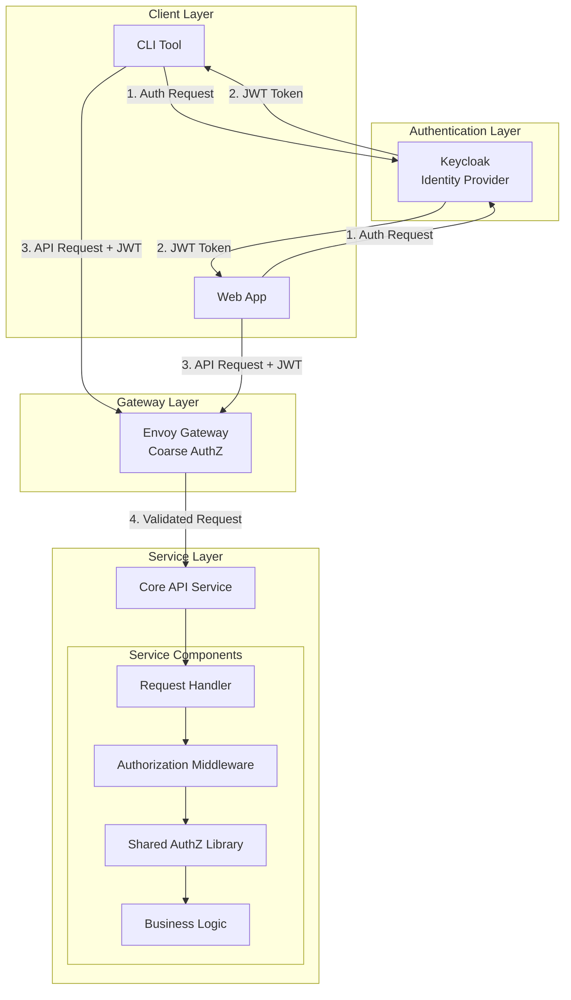
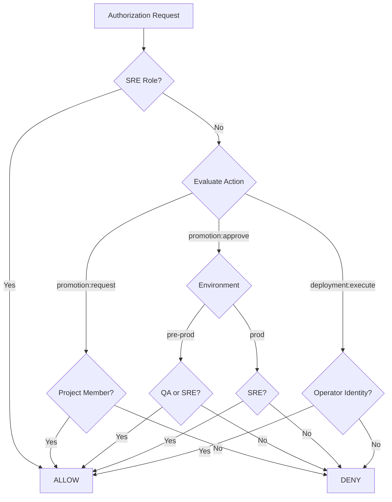
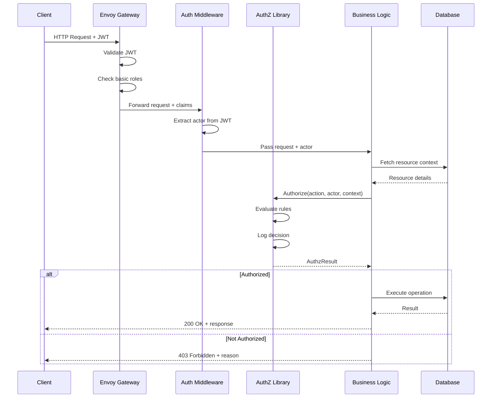
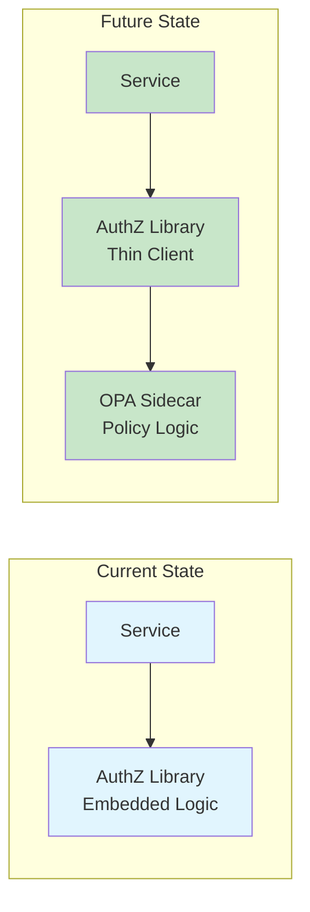
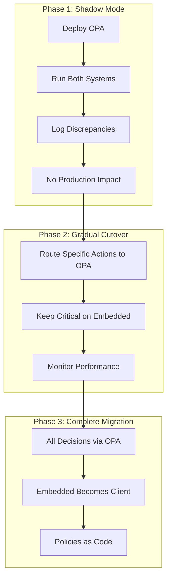
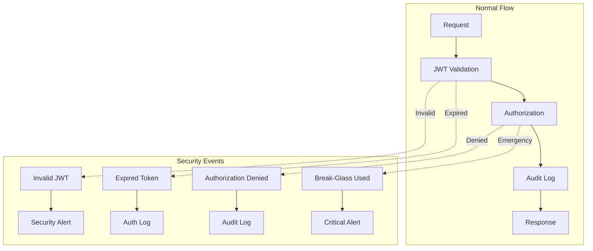

# Authorization Architecture Document

**Document Version:** 1.0
**Status:** Draft
**Last Updated:** 2025-01-02
**Author(s):** Platform Team
**Reviewers:** SRE Team, Engineering Leads

## Table of Contents

1. [Introduction](#1-introduction)
2. [System Overview](#2-system-overview)
3. [Architecture Components](#3-architecture-components)
4. [Authorization Model](#4-authorization-model)
5. [Implementation Specifications](#5-implementation-specifications)
6. [Integration Patterns](#6-integration-patterns)
7. [Operational Considerations](#7-operational-considerations)
8. [Migration Strategy](#8-migration-strategy)
9. [Security Considerations](#9-security-considerations)
10. [Appendices](#10-appendices)

---

## 1. Introduction

### 1.1 Purpose

This document defines the authorization architecture for the Catalyst Forge platform, complementing the Keycloak authentication system defined in the SRS. It establishes patterns for access control across all platform services while maintaining simplicity appropriate for our team size.

### 1.2 Scope

**In Scope:**
- Authorization patterns for platform APIs (Core API, Certificates API)
- Role and permission model
- Shared authorization library specification
- Integration with Keycloak-provided identity
- Future migration path to policy engines (OPA)

**Out of Scope:**
- Authentication (covered by Keycloak SRS)
- Customer-facing authorization
- Third-party service authorization (AWS, Argo CD, etc.)
- Detailed permission mappings for every endpoint

### 1.3 Design Principles

1. **Simplicity First**: Minimize operational complexity given our 2-person SRE team
2. **Migration-Ready**: Design for future policy engine adoption without major refactoring
3. **Fail Secure**: Deny by default, explicit allows only
4. **Observable**: All authorization decisions must be logged and traceable
5. **Testable**: Authorization logic must be unit-testable in isolation
6. **Consistent**: Same patterns across all services

### 1.4 Constraints

- Team size: ~30 engineers, 2 SREs
- No additional SaaS products for authorization
- Must integrate with Keycloak as identity provider
- JWT tokens must remain under 8KB
- Authorization decisions must add <5ms latency

---

## 2. System Overview

### 2.1 High-Level Architecture



### 2.2 Authorization Layers

1. **Gateway Layer (Coarse-grained)**
   - Envoy Gateway performs basic role checks
   - Ensures valid JWT and basic role presence
   - Forwards validated claims via headers

2. **Service Layer (Fine-grained)**
   - Services perform detailed authorization
   - Context-aware decisions based on resources
   - Audit logging of all decisions

### 2.3 Key Design Decisions

- **Embedded Authorization**: Authorization logic lives in a shared library, not external service
- **Role-Based with Context**: RBAC enhanced with resource context (project ownership, environment)
- **JWT Claims Minimization**: Only essential claims in JWT; detailed permissions looked up as needed
- **Future-Compatible Interface**: Input/output contracts match policy engine patterns (OPA)

---

## 3. Architecture Components

### 3.1 Identity Provider (Keycloak)

**Responsibilities:**
- User authentication
- JWT token issuance with core claims
- Basic role assignment (viewer, developer, qa, devx, sre)
- May include non-authoritative group claims; project membership is owned by the API

**JWT Claims Structure:**
```json
{
  "sub": "user-uuid",
  "email": "user@company.com",
  "name": "User Name",
  "roles": ["developer"],
  "groups": ["engineering", "project-foo-team"],
  "exp": 1234567890,
  "iat": 1234567890
}
```

### 3.2 Shared Authorization Library

**Responsibilities:**
- Standardized authorization interface
- Decision logging
- Context enrichment
- Caching of authorization data

**Technology:** Go library (internal package)

### 3.3 Service Authorization Middleware

**Responsibilities:**
- Extract JWT claims from request
- Build authorization context
- Call authorization library
- Handle authorization failures
- Log decisions with trace IDs

### 3.4 Domain Services (Core API)

**Responsibilities:**
- Manage domain entities (projects, releases, deployments)
- Provide resource context for authorization
- Enforce authorization decisions
- Maintain audit trail

---

## 4. Authorization Model

### 4.1 Core Concepts

#### Actors
- **Identity**: Unique user ID from Keycloak
- **Roles**: Coarse-grained platform roles (viewer, developer, qa, devx, sre)
- **Project Membership**: Owned by the API/DB (system of record); claims may mirror membership but are not authoritative
- **Context**: Additional claims from JWT

#### Actions
- Standardized verbs representing operations
- Format: `<resource>:<operation>`
- Environment and other resource attributes are carried in authorization context
- Examples: `deployment:execute`, `promotion:request`, `release:read`, `project:delete`

#### Resources
- Domain entities managed by services
- Hierarchical relationships (deployment → release → project)
- Resource-specific context (environment, project, team)

### 4.2 Role Definitions

| Role | Description | Typical Permissions |
|------|-------------|-------------------|
| `viewer` | Read-only access to all resources | All `:read` actions |
| `developer` | Standard development access | Read all; request promotions to dev |
| `qa` | Quality assurance access | Read all; approve promotions to pre‑prod |
| `devx` | Platform development/admin (non‑prod) | Platform config; non‑prod admin; cannot modify prod |
| `sre` | Full platform administration | All actions, including prod approvals |

### 4.3 Permission Model

Permissions are derived from:
1. **Platform Role**: Base permissions from Keycloak role
2. **Project Membership**: From API/DB membership (SoR), optionally mirrored into claims
3. **Resource Context**: Environment, ownership, state

#### Permission Decision Flow



### 4.4 Environment Hierarchy

Environments have implicit permission inheritance:
- `dev` < `pre‑prod` < `prod`
- Write access to higher environment implies access to lower

### 4.5 Actions Catalog

The following actions are required to satisfy platform needs (inputs omitted intentionally; enforcement uses context for environment, project, etc.). System‑only actions are held by service identities (operator/renderer), not humans.

- Release
  - `release:publish`
  - `release:read`
  - `release:list`
- Promotion
  - `promotion:request`
  - `promotion:approve`
  - `promotion:cancel`
- Deployment (system‑only)
  - `deployment:execute`
  - `deployment:cancel`
- Render (system‑only)
  - `render:start`
  - `render:inspect`
- GitOps (system‑only)
  - `gitops:prepare`
  - `gitops:commit`
- Project
  - `project:list`
  - `project:read`
  - `project:write`
  - `project:delete`
- Environment
  - `environment:list`
  - `environment:read`
- Artifacts & Provenance
  - `artifact:list`, `artifact:read`
  - `trace:read`, `events:read`
- Platform/Admin
  - `platform:config:read`, `platform:config:write`
  - `policy:read`, `policy:write`

### 4.6 Role guardrails (prod)

- `sre`: may approve promotions for any environment, including `prod`; may perform break‑glass under runbook.
- `devx`: platform admin for non‑prod only; cannot approve promotions or perform any action that modifies `prod` state.
- `qa`: may approve promotions to `pre‑prod`; cannot approve `prod`.
- `developer`: may request promotions; cannot approve `pre‑prod` or `prod`.

---

## 5. Implementation Specifications

### 5.1 Authorization Library Interface

```go
package authz

import (
    "context"
    "time"
)

// AuthzInput represents the standardized authorization request
type AuthzInput struct {
    Action  string                 `json:"action"`
    Actor   Actor                  `json:"actor"`
    Context map[string]interface{} `json:"context"`
}

// Actor represents the entity performing the action
type Actor struct {
    ID     string                 `json:"id"`
    Email  string                 `json:"email"`
    Roles  []string              `json:"roles"`
    Groups []string              `json:"groups"`
    Claims map[string]interface{} `json:"claims,omitempty"`
}

// AuthzResult represents the authorization decision
type AuthzResult struct {
    Allow     bool                   `json:"allow"`
    Reason    string                 `json:"reason,omitempty"`
    ExpiresAt *time.Time            `json:"expires_at,omitempty"`
    Context   map[string]interface{} `json:"context,omitempty"`
}

// Authorizer is the main authorization interface
type Authorizer interface {
    // Authorize makes an authorization decision
    Authorize(ctx context.Context, input AuthzInput) (AuthzResult, error)

    // Explain provides human-readable explanation of decision
    Explain(ctx context.Context, input AuthzInput) (string, error)

    // ValidActions returns all valid actions for introspection
    ValidActions() []string
}

// DecisionLogger logs authorization decisions for audit
type DecisionLogger interface {
    LogDecision(ctx context.Context, input AuthzInput, result AuthzResult, duration time.Duration)
}
```

### 5.2 Resource Context Enrichment

Services provide rich context for authorization decisions:

```go
// Example context for deployment authorization
type DeploymentContext struct {
    ID          string `json:"id"`
    Project     string `json:"project"`
    Environment string `json:"environment"`
    Release     string `json:"release"`
    CreatedBy   string `json:"created_by"`
    Critical    bool   `json:"critical"`
}
```

### 5.3 Action Definitions

Actions follow a consistent naming pattern:

```go
const (
    // Project actions
    ActionProjectList   = "project:list"
    ActionProjectRead   = "project:read"
    ActionProjectWrite  = "project:write"
    ActionProjectDelete = "project:delete"

    // Deployment actions (system-only)
    ActionDeploymentRead    = "deployment:read"
    ActionDeploymentExecute = "deployment:execute"

    // Release actions
    ActionReleaseRead    = "release:read"
    ActionReleasePublish = "release:publish"

    // Promotion actions
    ActionPromotionRequest = "promotion:request"
    ActionPromotionApprove = "promotion:approve"
)
```

### 5.4 Authorization Implementation Example

```go
type EmbeddedAuthorizer struct {
    logger DecisionLogger
}

func (e *EmbeddedAuthorizer) Authorize(ctx context.Context, input AuthzInput) (AuthzResult, error) {
    start := time.Now()
    defer func() {
        if e.logger != nil {
            e.logger.LogDecision(ctx, input, result, time.Since(start))
        }
    }()

    // Platform admin (SRE) can do anything
    if e.hasRole(input.Actor, "sre") {
        return AuthzResult{
            Allow:  true,
            Reason: "platform administrator",
        }, nil
    }

    // Route to specific authorizers
    switch {
    case strings.HasPrefix(input.Action, "promotion:"):
        return e.authorizePromotion(ctx, input)
    case input.Action == ActionDeploymentExecute:
        return e.authorizeDeploymentExecute(ctx, input)
    case strings.HasPrefix(input.Action, "release:"):
        return e.authorizeRelease(ctx, input)
    case strings.HasPrefix(input.Action, "project:"):
        return e.authorizeProject(ctx, input)
    default:
        return AuthzResult{
            Allow:  false,
            Reason: "unknown action",
        }, nil
    }
}

func (e *EmbeddedAuthorizer) authorizePromotion(ctx context.Context, input AuthzInput) (AuthzResult, error) {
    // Extract context
    project, _ := input.Context["project"].(string)
    environment, _ := input.Context["environment"].(string)

    // Check project membership via API/DB (system of record)
    if !e.isMemberOfProject(input.Actor, project) {
        return AuthzResult{
            Allow:  false,
            Reason: "not a member of project",
        }, nil
    }

    // Environment-specific approval rules
    switch environment {
    case "prod":
        // Only SRE may approve prod promotions
        if e.hasRole(input.Actor, "sre") {
            return AuthzResult{Allow: true, Reason: "sre approval for prod"}, nil
        }
        return AuthzResult{Allow: false, Reason: "prod promotion requires sre approval"}, nil

    case "pre‑prod":
        // QA or SRE may approve promotions to pre‑prod
        if e.hasAnyRole(input.Actor, []string{"qa", "sre"}) {
            return AuthzResult{Allow: true, Reason: "authorized for pre‑prod approval"}, nil
        }

    case "dev":
        // Any project member can request promotion to dev
        if e.hasAnyRole(input.Actor, []string{"developer", "devx", "qa"}) {
            return AuthzResult{Allow: true, Reason: "project member for dev promotion request"}, nil
        }
    }

    return AuthzResult{Allow: false, Reason: "insufficient permissions"}, nil
}

func (e *EmbeddedAuthorizer) authorizeDeploymentExecute(ctx context.Context, input AuthzInput) (AuthzResult, error) {
    // Only the operator service identity can execute deployments
    if e.isOperatorService(input.Actor) {
        return AuthzResult{Allow: true, Reason: "operator service"}, nil
    }
    return AuthzResult{Allow: false, Reason: "deployment execute is system-only"}, nil
}

func (e *EmbeddedAuthorizer) isMemberOfProject(actor Actor, project string) bool {
    // Example: consult API/DB membership; claims are not authoritative
    return e.lookupMembership(actor.ID, project)
}
```

---

## 6. Integration Patterns

### 6.1 Service Integration

```go
// Middleware for Gin framework
func AuthorizationMiddleware(authorizer authz.Authorizer) gin.HandlerFunc {
    return func(c *gin.Context) {
        // Extract claims from context (set by authentication middleware)
        claims, _ := c.Get("jwt_claims")
        userID, _ := c.Get("user_id")

        // Build actor from claims
        actor := authz.Actor{
            ID:     userID.(string),
            Email:  claims["email"].(string),
            Roles:  extractRoles(claims),
            Groups: extractGroups(claims),
            Claims: claims.(map[string]interface{}),
        }

        // Store actor for handler use
        c.Set("actor", actor)
        c.Next()
    }
}

// Handler example (promotion request)
func (h *Handler) RequestPromotion(c *gin.Context) {
    var req RequestPromotionRequest
    if err := c.ShouldBindJSON(&req); err != nil {
        c.JSON(400, gin.H{"error": err.Error()})
        return
    }

    // Get actor from context
    actor := c.MustGet("actor").(authz.Actor)

    // Build authorization input
    input := authz.AuthzInput{
        Action: ActionPromotionRequest,
        Actor:  actor,
        Context: map[string]interface{}{
            "project":     req.Project,
            "environment": req.Environment,
            "release":     req.Release,
            "reason":      req.Reason,
        },
    }

    // Authorize
    result, err := h.authorizer.Authorize(c.Request.Context(), input)
    if err != nil {
        c.JSON(500, gin.H{"error": "authorization failed"})
        return
    }

    if !result.Allow {
        c.JSON(403, gin.H{"error": result.Reason})
        return
    }

    // Proceed with business logic: create a promotion request; operator will execute deployment after approval
    promo, err := h.service.RequestPromotion(c.Request.Context(), req)
    if err != nil {
        c.JSON(500, gin.H{"error": err.Error()})
        return
    }

    c.JSON(201, promo)
}
```

### 6.2 Decision Logging

```go
type StructuredLogger struct {
    logger *slog.Logger
}

func (l *StructuredLogger) LogDecision(ctx context.Context, input AuthzInput, result AuthzResult, duration time.Duration) {
    l.logger.InfoContext(ctx, "authorization_decision",
        "trace_id", trace.FromContext(ctx).SpanContext().TraceID(),
        "action", input.Action,
        "actor_id", input.Actor.ID,
        "actor_roles", input.Actor.Roles,
        "resource_context", input.Context,
        "decision", result.Allow,
        "reason", result.Reason,
        "duration_ms", duration.Milliseconds(),
    )
}
```

### 6.3 Request Flow Sequence



---

## 7. Operational Considerations

### 7.1 Performance

- Authorization decisions must complete in <5ms
- Use in-memory caching for frequently accessed data
- Avoid network calls during authorization
- Pre-compute and cache role expansions

### 7.2 Monitoring

Key metrics to track:
- Authorization decision latency (p50, p95, p99)
- Decision outcomes (allow/deny ratio by action)
- Cache hit rates
- Failed authorization attempts by user

### 7.3 Debugging

Each authorization decision should be traceable:
```json
{
  "trace_id": "abc123",
  "timestamp": "2025-01-02T10:00:00Z",
  "action": "promotion:approve",
  "actor_id": "user-123",
  "decision": false,
  "reason": "not a member of project",
  "duration_ms": 2
}
```

### 7.4 Testing

```go
func TestDeploymentAuthorization(t *testing.T) {
    authorizer := NewEmbeddedAuthorizer()

    tests := []struct {
        name   string
        input  AuthzInput
        expect bool
    }{
        {
            name: "sre_can_approve_anywhere",
            input: AuthzInput{
                Action: ActionPromotionApprove,
                Actor:  Actor{ID: "1", Roles: []string{"sre"}},
                Context: map[string]interface{}{
                    "project": "foo",
                    "environment": "prod",
                },
            },
            expect: true,
        },
        {
            name: "developer_cannot_approve_prod",
            input: AuthzInput{
                Action: ActionPromotionApprove,
                Actor:  Actor{
                    ID: "2",
                    Roles: []string{"developer"},
                },
                Context: map[string]interface{}{
                    "project": "foo",
                    "environment": "prod",
                },
            },
            expect: false,
        },
    }

    for _, tt := range tests {
        t.Run(tt.name, func(t *testing.T) {
            result, err := authorizer.Authorize(context.Background(), tt.input)
            require.NoError(t, err)
            assert.Equal(t, tt.expect, result.Allow)
        })
    }
}
```

---

## 8. Migration Strategy

### 8.1 Future State Architecture

When operational complexity justifies it, we can migrate to OPA:



### 8.2 Migration Triggers

Consider migration when:
- Authorization rules exceed 100 lines of code
- Policy changes require code deployments
- Non-technical staff need to modify policies
- Compliance requires policy-as-code

### 8.3 Migration Path



### 8.4 Interface Stability

The `Authorizer` interface remains stable:
```go
// This interface doesn't change during migration
type Authorizer interface {
    Authorize(ctx context.Context, input AuthzInput) (AuthzResult, error)
    Explain(ctx context.Context, input AuthzInput) (string, error)
    ValidActions() []string
}
```

---

## 9. Security Considerations

### 9.1 Principles

- **Default Deny**: Explicit allows only
- **Fail Closed**: Authorization errors result in deny
- **No Privilege Escalation**: Users cannot grant themselves additional permissions
- **Audit Everything**: All decisions logged with context

### 9.2 Token Security

- JWT validation happens before authorization
- Expired tokens rejected at gateway
- Role claims verified against Keycloak

### 9.3 Break-Glass Access

For emergencies:
```go
// Break-glass override (SRE only, heavily audited)
if ctx.Value("break_glass").(bool) && actor.Roles.Contains("sre") {
    logger.Alert("BREAK_GLASS_ACCESS", actor, action)
    return AuthzResult{
        Allow: true,
        Reason: "break-glass emergency access",
        Context: map[string]interface{}{
            "break_glass": true,
            "expires_at": time.Now().Add(1 * time.Hour),
        },
    }, nil
}
```

### 9.4 Security Event Flow



---

## 10. Appendices

### Appendix A: Common Authorization Patterns

```go
// Check if user can read any resource in a project
func CanReadProject(actor Actor, project string) bool {
    return actor.HasRole("viewer") || lookupMembership(actor.ID, project)
}

// Check if user can modify production
func CanModifyProduction(actor Actor) bool {
    return actor.HasRole("sre")
}

// Check resource ownership
func OwnsResource(actor Actor, resourceOwnerID string) bool {
    return actor.ID == resourceOwnerID
}
```

### Appendix B: Glossary

| Term | Definition |
|------|------------|
| **Actor** | The authenticated entity performing an action |
| **Action** | A standardized operation identifier (e.g., `deployment:write`) |
| **Resource** | A domain entity being acted upon |
| **Context** | Additional information about the resource or request |
| **Principal** | The identity making the authorization request |
| **PDP** | Policy Decision Point - where authorization decisions are made |
| **PEP** | Policy Enforcement Point - where decisions are enforced |
| **RBAC** | Role-Based Access Control |
| **ABAC** | Attribute-Based Access Control |
| **JWT** | JSON Web Token |
| **OPA** | Open Policy Agent |

### Appendix C: Decision Log Schema

```json
{
  "$schema": "http://json-schema.org/draft-07/schema#",
  "type": "object",
  "required": ["timestamp", "trace_id", "action", "actor_id", "decision"],
  "properties": {
    "timestamp": {"type": "string", "format": "date-time"},
    "trace_id": {"type": "string"},
    "action": {"type": "string"},
    "actor_id": {"type": "string"},
    "actor_roles": {"type": "array", "items": {"type": "string"}},
    "actor_groups": {"type": "array", "items": {"type": "string"}},
    "resource_context": {"type": "object"},
    "decision": {"type": "boolean"},
    "reason": {"type": "string"},
    "duration_ms": {"type": "number"}
  }
}
```