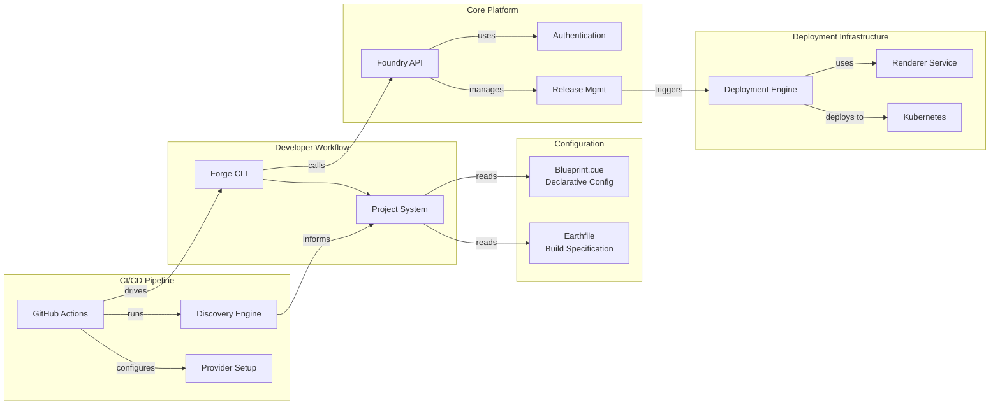

# Welcome to Catalyst Forge

Catalyst Forge is a blueprint-driven development platform that provides enterprise-grade tools for building, testing, and deploying software at scale. It standardizes modern DevOps practices through a unified command-line interface and a powerful configuration system, enabling developers to focus on writing code while the platform handles the complexities of the software lifecycle.

## Core Concepts

To understand Catalyst Forge, it's essential to grasp these fundamental concepts:

| Concept | Description |
| --- | --- |
| **Project** | A discoverable, self-contained unit of work identified by a `blueprint.cue` file. It can be an application, a library, or a utility, and contains all the source code and configuration required to build, test, and deploy it. |
| **Blueprint** | A declarative configuration file written in CUE (`blueprint.cue`) that defines how a project behaves. It specifies CI/CD pipelines, deployment targets, release processes, and external provider integrations. |
| **`forge` CLI** | A powerful Go-based command-line interface that serves as the main entry point for developers. It wraps tools like Earthly and CUE to provide a consistent experience for building projects, managing secrets, simulating CI, and deploying applications. |
| **Earthfile** | An optional but recommended build specification that defines the targets for building and testing your project in a containerized, repeatable environment. It integrates seamlessly with the `forge run` command. |

## How it Works

Catalyst Forge streamlines the development workflow into a simple, repeatable process:

1.  **Define**: Configure your application in a `blueprint.cue` file, specifying its build targets, deployment environments, and release triggers.
2.  **Build & Test**: Use the `forge` CLI to execute containerized builds with Earthly, run tests, and even simulate the entire CI pipeline locally with an interactive terminal UI. The CLI injects secrets and configuration from your blueprint, ensuring local and CI environments are identical.
3.  **Deploy**: When ready, the platform uses your blueprint to automate releases and deploy your application to Kubernetes environments with GitOps principles.

This approach ensures that every project follows the same standards, from local development to production deployment, reducing configuration drift and improving reliability.

## Architecture Overview

Catalyst Forge is composed of several integrated components that work together to provide a seamless development experience.

-   **Forge CLI**: The primary interface for developers. Built in Go, its context-driven engine interprets blueprints to execute tasks like containerized builds, deployments, and secret management.
-   **Project System**: Discovers and loads project configurations from `blueprint.cue` files across the repository.
-   **GitHub Actions**: Orchestrates the CI/CD pipeline, from project discovery and provider setup to automated releases and deployments.
-   **Foundry API**: A central RESTful service that manages authentication, and orchestrates release and deployment processes.
-   **Deployment Engine**: A multi-provider system (KCL, Helm, Git) that generates Kubernetes manifests from deployment bundles.
-   **Renderer Service**: A gRPC microservice that transforms deployment configurations into deployable Kubernetes YAML.

## Get Started

Ready to dive in? Our tutorials will guide you through the installation process and help you create your first project in minutes.

[Start the Tutorial →](getting-started/index.md){ .md-button .md-button--primary }

## Who is This For?

Catalyst Forge is designed to meet the needs of various technical roles:

-   **For Development Teams**: Standardize build and deployment processes across all your projects. Manage secrets and configuration safely while enabling GitOps workflows with comprehensive audit trails.
-   **For Platform Engineers**: Provide self-service deployment capabilities that enforce security and compliance policies automatically. Scale your organization's development practices with consistent, reliable tooling.
-   **For DevOps Engineers**: Integrate with GitHub Actions for fully automated workflows that support multi-platform builds and releases. Enable secure, automated deployments with role-based access controls.
