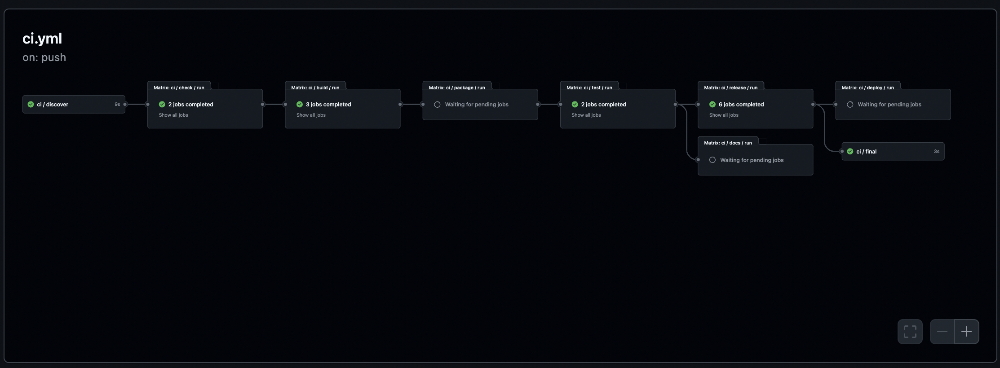

# Getting Started

In this tutorial, we will create a sample project that will be automatically validated, built, and published by Catalyst Forge.
During this process, we will encounter the various tools and configurations that power Catalyst Forge.
By the end of this tutorial, you will be equipped to begin developing your own projects.

We will be building a trivial program in the Python language in order to facilitate learning.
Python was chosen due to its simplicity and more well-known nature.
Understanding the Python language is not required, and more adventerous learners may choose to substitute the code with their
language of choice.
Catalyst Forge is language agnostic; all that is required is knowing how to build and validate your language of choice.

## Pre-requisites

!!! note

    External contributors will only be able to partially complete this tutorial.
    This is due to the fact that permissions on most repositories (including the playground) do not allow external contributors to
    arbitrarily merge code.
    If you're an external contributor, feel free to follow the tutorial up to the point where merging is required.

Prior to starting this tutorial, please ensure you have the following available on your machine:

1. The latest version of the [forge CLI](https://github.com/input-output-hk/catalyst-forge/releases)
2. A recent version of [Earthly](https://earthly.dev/) installed and configured

## Project Setup

To begin, clone the [catalyst-forge-playground](https://github.com/input-output-hk/catalyst-forge-playground) locally.
Next, copy the `examples/python` directory to a new directory under `users` using your GitHub username:

```shell
cp -r examples/python users/myusername
```

The example consists of a simple Python CLI that takes a single argument and prints: `"Hello, <arg>!` to the screen.
The project was created using the [uv](https://docs.astral.sh/uv/) CLI.
The Python package has already been configured to install itself as a script named `hello`.

## Creating an Earthfile

Catalyst Forge uses [Earthly](https://earthly.dev/) underneath the hood for creating the CI pipeline.
It's recommended you take time to become familiar with Earthly and run through their onboarding documentation.
In this tutorial we will create various Earthly "targets" that will be responsible for performing specific steps in the pipeline.

To begin, we will create a simple `Earthfile` in our folder that will validate our code for us:

```earthly
VERSION 0.8

uv:
    FROM ghcr.io/astral-sh/uv:0.4.12

    SAVE ARTIFACT /uv uv

deps:
    FROM python:3.12-slim-bookworm

    ENV UV_COMPILE_BYTECODE=0

    WORKDIR /work

    COPY +uv/uv /usr/local/bin/uv
    COPY pyproject.toml uv.lock README.md .

    RUN uv sync --frozen --no-install-project

src:
    FROM +deps

    COPY --dir src README.md .
```

Most of the above targets are there to install `uv` in the container and initialize the container environment.
The `src` target will contain all of the code and dependencies we need to run our application.

### Checking

Add the following target to the `Earthfile`:

```earthfile
check:
    FROM +src

    RUN uv sync --frozen --no-install-project --extra dev

    RUN uv run black --check .
    RUN uv run ruff check .
```

The `check` target is automatically run for us as the first step in the CI pipeline.
It's intended to have a short execution time.
In the above case, we are validating formatting and performing linting, both which tend to execute relatively quickly.

Validate that the `check` target passes with no issues:

```
forge run +check
```

When testing a target locally, it's recommended you use the `forge` CLI over the native `earthly` CLI.
During CI runs, the `forge` CLI is used to execute all Earthly targets.
This ensures more consistency between running the target locally and when running it in CI, as the CLI adds several additional
features that are not natively present in Earthly.

### Building

We will build our CLI as a Python wheel to make distributing/publishing it easier.
To do this, add a new `build` target to the `Earthfile`:

```earthfile
build:
    FROM +src

    RUN uv build --wheel

    SAVE ARTIFACT dist dist
```

Like the previous target, the `build` target is also called by CI.
This ensures that the `build` can run successfully before calling additional targets that might rely on it (it also caches it).
In the above case, `uv` will build our wheel and place it in the `dist/` folder for us.
We save the entire folder as an artifact for later targets to use.

### Testing

For running our tests, we will add a `test` target to the `Earthfile`:

```
test:
    FROM +src

    COPY --dir tests .

    RUN uv sync --frozen --extra dev
    RUN uv run pytest .
```

Like the `check` target, the `test` target is also called by CI.
It's intended to be used for running all tests in a project (including unit and integration tests).
Since we're using `pytest`, we only need to call it for our simple unit test to run.

### Containerizing

We will now create our first "release" target.
These targets are special in that they each serve different purposes but generally fall into the "release" category.
Unlike the other targets, release targets are not required to be a specific name, although it's common to use the same name as the
release type.

We will start by creating our `docker` release target.
As the name suggests, this release type is responsible for building the container that will be published to configured registries.
To do this, add a new `docker` target to the `Earthfile`:

```earthfile
docker:
    FROM python:3.12-slim

	ARG container=hello
	ARG tag=latest

    WORKDIR /app

    COPY +build/dist dist

    RUN pip install dist/*.whl

	SAVE IMAGE ${container}:${tag}
```

This target copies the wheel from the `build` target and then globally installs it into the container.
Since we've configured a script entry in our `pyproject.toml`, the CLI can be run by executing `hello`.

The CI will automatically pass in the `container` and `tag` arguments in order to set the container name.
These arguments are not optional and must be included in all docker release targets.

Let's now build our image and make sure it works:

```shell
$ forge run +docker
$ docker run hello:latest test
Hello, test!
```

Unlike the other targets, all release targets are run in parallel in a single step of the CI pipeline.
The release targets are generally run towards the end of the CI pipeline after all projects have been built and validated.
We will configure the specifics of this release target in a later step.

### Releasing

The second release target, and our final target in the tutorial, will be the `github` target.
This release type is responsible for building and uploading artifacts from our project into a new GitHub release.
Like the previous release type, we will add a `github` target to the Earthfile:

```earthfile
github:
    FROM scratch

    COPY +build/dist dist

    SAVE ARTIFACT dist/* hello.whl
```

This release type expects artifacts to be produced by the target.
All artifacts are archived, compressed, and uploaded as assets when a new release is created.

In this case, we output our Python wheel as an artifact, which is itself a sort of archive.
You can validate this behavior by running the following:

```shell
$ forge run --artifact out +release
$ unzip -l out/linux/amd64/dist
Archive:  out/linux/amd64/dist
  Length      Date    Time    Name
---------  ---------- -----   ----
        0  02-02-2020 00:00   hello/__init__.py
      241  02-02-2020 00:00   hello/hello.py
      288  02-02-2020 00:00   hello-0.1.0.dist-info/METADATA
       87  02-02-2020 00:00   hello-0.1.0.dist-info/WHEEL
       42  02-02-2020 00:00   hello-0.1.0.dist-info/entry_points.txt
      433  02-02-2020 00:00   hello-0.1.0.dist-info/RECORD
---------                     -------
     1091                     6 files
```

Depending on your local architecture, the path to the artifact may be different.

## Adding a Blueprint

Catalyst Forge uses blueprint files in order to both identify projects within a repository as well as configure them.
Add a new file in the root of the project folder called `blueprint.cue` with the following contents:

```cue
version: "1.0.0"
project: {
	name: "hello-jmgilman" // Replace "jmgilman" with your GitHub username
}
```

A blueprint file in a directory signifies that it is a _project_ within a repository.
Many of the Catalyst automation systems interact with projects inside of a repository and use the existence of this file to
distinguish them.
For example, without this file, our `Earthfile` would be ignored by the CI system and none of our targets would run in the pipeline.

The only required field in a blueprint file is the project name (shown as `hello-jmgilman` above).
This name should be unique across all repositories and is used to distinguish the project in several area (i.e. the container name).
There are many more useful fields exposed in a blueprint file that can be explored later in the documentation.

### Configuring Releases

The last step before pushing our code is to configure our releases in the blueprint file.

```cue
version: "1.0.0"
project: {
	name: "hello-jmgilman"
	release: {
		docker: {
			on: {
				merge: {}
				tag: {}
			}
			config: {
				tag: _ @forge(name="GIT_COMMIT_HASH")
			}
		}
		github: {
			on: tag: {}
			config: {
				name:   string | *"dev" @forge(name="GIT_TAG")
				prefix: project.name
				token: {
					provider: "env"
					path:     "GITHUB_TOKEN"
				}
			}
		}
	}
}
```

We've configured two releases: `docker` and `github`.
The "type" of the release is the same as the name.
Each release has an `on` field that specifies when the release is run and a `config` field that specifies type-specific options for
the release.
To learn more about releases, see the appropriate section in the documentation.

## Testing Locally

Prior to pushing our changes in a PR, let's test the full CI pipeline locally:

```
forge ci --local .
```

The `.` parameter is important as it will scope the CI run to only our project.
If everything is working correctly, all targets should be run in the correct order and pass with a green checkmark.
We've now built our sample application, validated and tested it, and even have potential publish and release artifacts for it.

## Submiting to CI

!!! note

    The CI system in the playground is not connected to any remote build servers for security reasons.
    As a result, builds will _not_ be cached and will start from scratch each time.

Now that we've validated everything locally, we will push our changes to a new branch and open up a PR.
After opening the PR, you should see a new GitHub Action workflow start.



Examining the workflow, you can see that it follows the same steps as was shown in our local run.
The only difference is that _all_ projects within the repository are being run in parallel.
If any of these projects fail, the entire pipeline will fail.
This is intentional, as all projects should be successfully building before merging a PR to the default branch.

## Releasing and Publishing

!!! note

    The steps below require permissions to merge and tag the playground repository.
    If you don't have these permissions, you may still read on for educational purposes.
    Alternatively, you may seek someone out with the necesary permissions to help you (feel free to open an issue!).

Once the PR has successfully passed CI, proceed with merging it to the default branch (please use squash merges).
After the merge, a new GitHub Workflow will run for this particular commit.
Allow the workflow to run to completion before proceeding.

Once the workflow has completed, you'll notice a new package created for the GitHub Container Registry.
The package will have the same name as the one defined in `project.name` and, as we configured, will have a tag created that
matches the commit hash of the merge commit.
Since we configured the `docker` release to run on `merge` events (which defaults to merges to the main branch), it automatically
ran and published our container image.

For the final step, we will tag the repository with an application specific tag:

```shell
git tag -a "hello-jmgilman/v1.0.0" -m "My first version"
git push origin master
```

The convention used above is important: `<project_name>/<version>`.
By default, the `tag` event used in our `github` release type only triggers when a tag matching the project name is pushed.
This ensures that projects are all versioned separately in the repository.
After creating and pushing this tag, a new workflow is created and the CI pipeline runs again.
Allow the new workflow to run to completion before proceeding.

Once the workflow is completed, you'll notice that a new release is created on GitHub with the name set to our git tag (this is
what we configured the name to earlier).
The release will contain a single artifact which is the Python wheel created by our `github` release.
Notice that no other projects had a release added.

## Conclusion

That's it for this getting started tutorial.
You now understand the fundamentals of creating and managing projects using Catalyst Forge!

