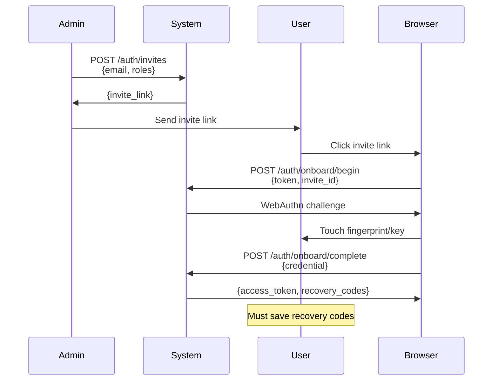
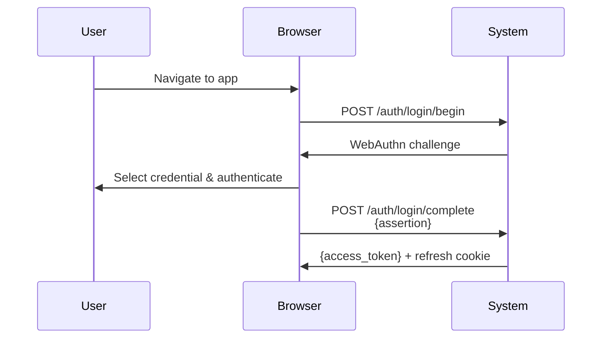
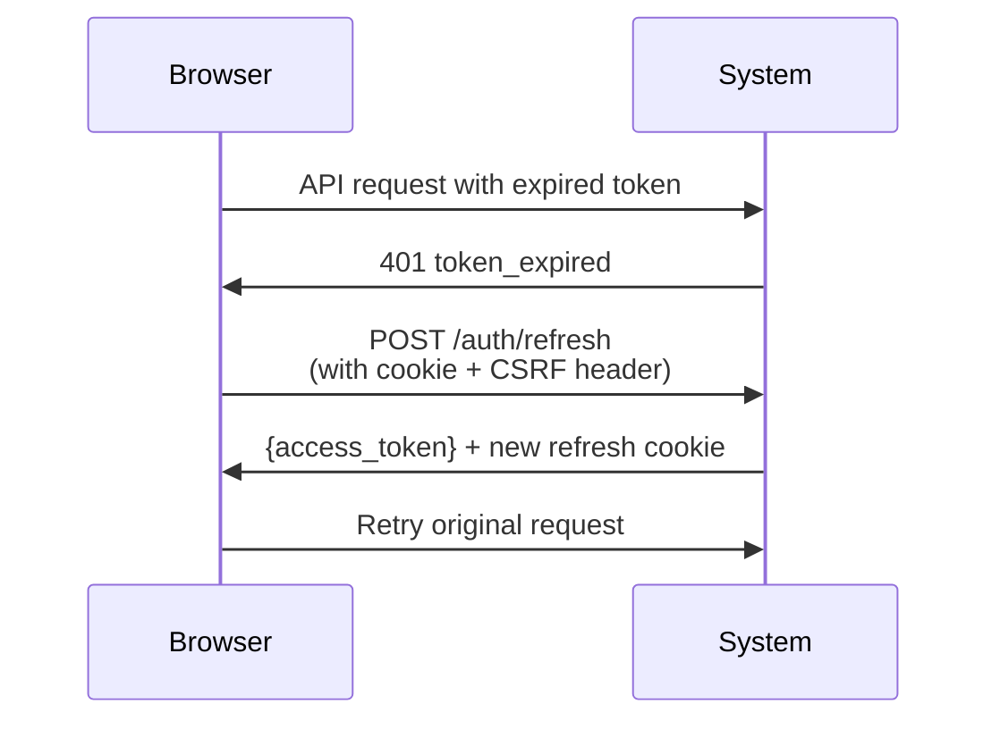
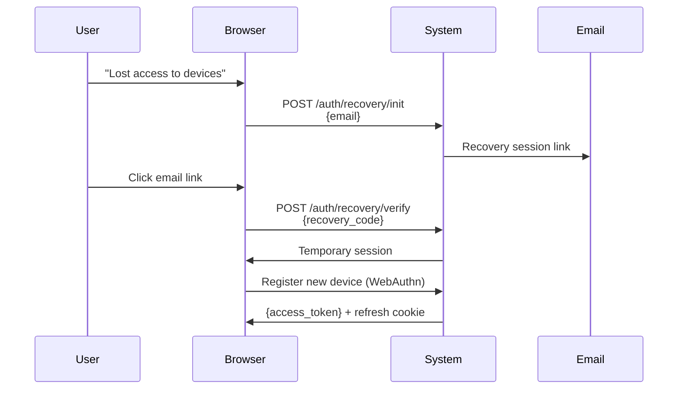

# Catalyst Forge AuthKit

A complete passwordless authentication system using WebAuthn, designed for enterprise-grade security without external OAuth dependencies.

## Overview

AuthKit provides a self-contained, passwordless authentication system that eliminates password-based attacks and OAuth provider dependencies. All authentication is handled through WebAuthn (Passkeys and Hardware Security Keys), with cryptographically secure invite-based onboarding and advanced session management.

### Key Features

- **Passwordless Authentication**: Uses WebAuthn/Passkeys exclusively - no passwords ever created or stored
- **No External Dependencies**: Self-contained system without OAuth providers
- **Hardware Key Enforcement**: Administrators must use hardware security keys (YubiKey, etc.)
- **Advanced Session Management**: JWT access tokens with refresh rotation and family tracking
- **Step-Up Authentication**: Recent WebAuthn verification required for sensitive operations
- **Rate Limiting**: Identity-based rate limiting without IP address dependencies
- **Policy-Based Authorization**: Declarative path/method-based access control
- **Comprehensive Audit Logging**: Full security event tracking

## Architecture

AuthKit follows clean architecture principles with clear separation of concerns:

```
/authkit
├── authkit/         # Public facade and integration points
├── domain/          # Pure domain entities (database-agnostic)
├── service/         # Business logic and use cases
├── store/           # Storage interfaces and implementations
├── crypto/          # Cryptographic operations and key management
├── httpkit/         # HTTP utilities (cookies, CSRF, responses)
├── middleware/      # Authentication and authorization middleware
├── rate/            # Rate limiting interfaces and implementations
└── testing/         # Test utilities and in-memory implementations
```

## Quick Start

### 1. Installation

```bash
go get github.com/catalystgo/catalyst-forge/lib/foundry/authkit
```

### 2. Basic Configuration

```go
package main

import (
    "github.com/gin-gonic/gin"
    "github.com/catalystgo/catalyst-forge/lib/foundry/authkit/authkit"
    "github.com/catalystgo/catalyst-forge/lib/foundry/authkit/store/gormstore"
    "github.com/catalystgo/catalyst-forge/lib/foundry/authkit/crypto"
)

func main() {
    // 1. Configure the authentication system
    cfg := authkit.DefaultConfig()
    cfg.RPName = "Your Application"
    cfg.RPID = "yourdomain.com"
    cfg.Origin = "https://yourdomain.com"

    // 2. Setup dependencies (database, crypto, etc.)
    deps := authkit.Deps{
        Stores: setupStores(),    // Your database implementation
        Keys:   setupCrypto(),    // JWT signing keys
        // ... other dependencies
    }

    // 3. Initialize AuthKit
    auth, err := authkit.New(cfg, deps)
    if err != nil {
        panic(err)
    }

    // 4. Setup your Gin router
    router := gin.Default()

    // 5. Mount authentication routes
    auth.RegisterRoutes(router.Group("/auth"))
    if cfg.JWKSRoute {
        auth.RegisterJWKS(router.Group("/.well-known"))
    }

    // 6. Apply global authentication middleware
    router.Use(auth.Authenticate())

    // 7. Define authorization policies
    policies := authkit.NewPolicyRegistry().
        RequireAuth("GET", "/api/protected/*").
        RequireRoles([]string{"admin"}, "POST", "/api/admin/*").
        RequireStepUp("POST", "/api/admin/users", "/api/admin/deploy")

    router.Use(auth.EnforcePolicies(policies))

    // 8. Your existing handlers work unchanged
    router.GET("/api/protected/data", getProtectedData)
    router.POST("/api/admin/deploy", deployInfrastructure)

    router.Run(":8080")
}
```

### 3. Policy-Based Authorization

AuthKit uses a declarative policy system that eliminates auth boilerplate from your handlers:

```go
// Define policies once, globally
policies := authkit.NewPolicyRegistry().
    // Require authentication for all API endpoints
    RequireAuth("*", "/api/*").
    
    // Admin endpoints require admin role
    RequireRoles([]string{"admin"}, "GET", "/api/admin/*").
    RequireRoles([]string{"admin"}, "POST", "/api/admin/*").
    
    // Critical operations require step-up authentication
    RequireStepUp("POST", "/api/admin/users").
    RequireStepUp("POST", "/api/admin/deploy").
    RequireStepUp("DELETE", "/api/admin/*").
    
    // Operations team can deploy
    RequireRoles([]string{"admin", "ops"}, "POST", "/api/deploy/*").
    
    // Read-only access for viewers
    RequireRoles([]string{"admin", "ops", "viewer"}, "GET", "/api/metrics/*")

// Apply policies globally - no handler changes needed
router.Use(auth.EnforcePolicies(policies))
```

**Pattern Matching**:
- `"/api/users"` - Exact path match
- `"/api/users/*"` - Prefix match (matches `/api/users/123`, `/api/users/123/edit`)
- `"/^/api/users/\\d+$/"` - Regex match (wrap in forward slashes)

### 4. Accessing Authentication Context

Your handlers can optionally read authentication information:

```go
func getProtectedData(c *gin.Context) {
    // Get authentication context (optional)
    if authCtx, exists := authkit.From(c); exists {
        log.Printf("Request from user: %s (%s)", authCtx.Email, authCtx.UserID)
        
        // Check roles/permissions if needed
        if authCtx.HasRole("admin") {
            // Admin-specific logic
        }
        
        // Check if user recently authenticated (for step-up)
        if authCtx.RequiresStepUp(time.Now()) {
            // This shouldn't happen if policies are correct,
            // but you can handle edge cases
        }
    }
    
    // Your normal handler logic
    c.JSON(200, gin.H{"data": "protected content"})
}
```

## Core Concepts

### WebAuthn Authentication

AuthKit exclusively uses the WebAuthn standard for all authentication:

- **Passkeys**: Syncable credentials via iCloud, Google Password Manager, etc.
- **Hardware Security Keys**: Physical FIDO2 devices (YubiKey, etc.)
- **Platform Authenticators**: Touch ID, Face ID, Windows Hello

**Administrator Security**: Admin users must use hardware security keys (enforced via AAGUID verification).

### Session Management

**Access Tokens (JWT)**:
- 30-minute lifetime (configurable)
- Asymmetric ES256 signing
- Contains user info, roles, permissions, session version
- Stored in memory only (never localStorage)

**Refresh Tokens**:
- 30-day lifetime (configurable)
- Opaque tokens stored as SHA256 hashes
- HttpOnly cookies with `__Host-` prefix
- Automatic rotation on each use
- Family tracking for replay detection

**Session Versioning**:
- Increment version to invalidate all user sessions
- Triggered by role changes, security events, or explicit logout

### Step-Up Authentication

Critical operations require recent WebAuthn authentication:

```go
// Configure which operations require step-up
policies := authkit.NewPolicyRegistry().
    RequireStepUp("POST", "/api/admin/users").
    RequireStepUp("DELETE", "/api/data/*").
    RequireStepUp("POST", "/api/deploy")
```

When step-up is required:
1. Client receives 401 with `step_up_required` error
2. Client initiates WebAuthn ceremony via `/auth/step-up/begin`
3. User authenticates with their device
4. Client completes step-up via `/auth/step-up/complete`
5. Client retries original request with fresh token

## Configuration

### Required Configuration

```go
cfg := authkit.Config{
    // WebAuthn Configuration (Required)
    RPName: "Your Application Name",         // Display name shown to users
    RPID:   "yourdomain.com",               // Your domain
    Origin: "https://yourdomain.com",       // Full origin URL
    
    // Database and crypto dependencies via Deps struct
}
```

### Optional Configuration

```go
cfg := authkit.DefaultConfig()

// Token Lifetimes
cfg.AccessTokenTTL = 30 * time.Minute     // JWT lifetime
cfg.RefreshTokenTTL = 30 * 24 * time.Hour // Refresh cookie lifetime
cfg.StepUpTTL = 5 * time.Minute           // Step-up validity window

// WebAuthn Settings
cfg.ChallengeTTL = 5 * time.Minute        // Challenge timeout
cfg.RequireUV = true                      // Require user verification

// Cookie Security
cfg.RefreshCookieName = "__Host-refresh_token"
cfg.SecureCookies = true                  // HTTPS only
cfg.SameSite = http.SameSiteStrictMode    // CSRF protection

// Features
cfg.JWKSRoute = true                      // Expose /.well-known/jwks.json
cfg.RateEnabled = false                   // Enable rate limiting

// Invites
cfg.InviteDefaultTTL = 72 * time.Hour     // Invite expiration
cfg.InviteMaxAttempts = 5                 // Failed attempts before lock

// Admin Security
cfg.AdminAAGUIDAllowlist = []string{      // Approved hardware keys
    "2fc0579f-8113-47ea-b116-bb5a8db9202a", // YubiKey 5 NFC
    "fa2b99dc-9e39-4257-8f92-4a30d23c4118", // YubiKey 5Ci
    // ... add your approved hardware key AAGUIDs
}
```

### Environment Variables

```bash
# Required Secrets
INVITE_HASH_SECRET=your-32-byte-hex-key     # For invite token security
JWT_SIGNING_KEY=your-es256-private-key      # For JWT signing
JWT_KID=2024-q4                             # Key rotation identifier

# Optional Settings
WEBAUTHN_RP_NAME="Your Application"
WEBAUTHN_RP_ID=yourdomain.com
WEBAUTHN_ORIGIN=https://yourdomain.com
STEP_UP_WINDOW=5m
ACCESS_TOKEN_TTL=30m
REFRESH_TOKEN_TTL=720h
```

## User Flows

### 1. New User Onboarding



### 2. Returning User Login



### 3. Token Refresh



### 4. Account Recovery



## API Endpoints

AuthKit provides all authentication endpoints - your app doesn't implement any:

### Authentication Endpoints

| Method | Endpoint | Purpose |
|--------|----------|---------|
| `POST` | `/auth/onboard/begin` | Start new user registration |
| `POST` | `/auth/onboard/complete` | Complete user registration |
| `POST` | `/auth/login/begin` | Start login process |
| `POST` | `/auth/login/complete` | Complete login process |
| `POST` | `/auth/refresh` | Refresh expired access token |
| `POST` | `/auth/logout` | Logout current session |
| `POST` | `/auth/logout-all` | Logout all user sessions |

### Step-Up Authentication

| Method | Endpoint | Purpose |
|--------|----------|---------|
| `POST` | `/auth/step-up/begin` | Start step-up authentication |
| `POST` | `/auth/step-up/complete` | Complete step-up authentication |

### Account Recovery

| Method | Endpoint | Purpose |
|--------|----------|---------|
| `POST` | `/auth/recovery/init` | Initiate account recovery |
| `POST` | `/auth/recovery/verify` | Verify recovery code |
| `POST` | `/auth/recovery/register/begin` | Start new device registration |
| `POST` | `/auth/recovery/register/complete` | Complete new device registration |

### Device Management

| Method | Endpoint | Purpose |
|--------|----------|---------|
| `POST` | `/auth/credentials/add/begin` | Start adding new device |
| `POST` | `/auth/credentials/add/complete` | Complete adding new device |

### Admin Endpoints

| Method | Endpoint | Purpose |
|--------|----------|---------|
| `POST` | `/auth/invites` | Create user invites |
| `POST` | `/auth/admin/users/:id/force-logout` | Force user logout |

### Utility Endpoints

| Method | Endpoint | Purpose |
|--------|----------|---------|
| `GET` | `/.well-known/jwks.json` | JWT verification keys |

## Security Features

### Cookie Security

Refresh tokens use `__Host-` prefix for maximum security:

```
Set-Cookie: __Host-refresh_token=<token>; 
    Secure; HttpOnly; SameSite=Strict; Path=/auth; Max-Age=2592000
```

The `__Host-` prefix enforces:
- HTTPS only (`Secure` flag required)
- No subdomain access
- Cannot be overwritten by insecure contexts

### CSRF Protection

Two-layer CSRF protection:
1. **SameSite=Strict cookies** - prevents cross-site cookie transmission
2. **Custom header requirement** - `X-Requested-With: XMLHttpRequest` on state-changing endpoints

### Rate Limiting

Identity-based rate limiting (not IP-based):

| Endpoint | Identifier | Limit | Window |
|----------|-----------|-------|---------|
| Login | Email address | 5 attempts | 15 minutes |
| Onboard | Invite ID | 5 attempts | Until expiry |
| Recovery | Email address | 3 attempts | 1 hour |
| Refresh | User ID | 100 attempts | 1 hour |

### Hardware Key Enforcement

Admin users must use approved hardware security keys:

```go
cfg.AdminAAGUIDAllowlist = []string{
    "2fc0579f-8113-47ea-b116-bb5a8db9202a", // YubiKey 5 NFC
    "fa2b99dc-9e39-4257-8f92-4a30d23c4118", // YubiKey 5Ci
    // Add your approved AAGUIDs
}
```

AAGUIDs are cryptographically verified during registration via WebAuthn attestation.

## Database Schema

AuthKit requires several tables for operation. Using GORM AutoMigrate:

```go
// In your migration or setup code
db.AutoMigrate(
    &gormstore.User{},
    &gormstore.Credential{},
    &gormstore.Invite{},
    &gormstore.RecoveryCode{},
    &gormstore.RefreshToken{},
    &gormstore.AuditEvent{},
)
```

### Core Tables

**Users**: `id`, `email`, `roles_json`, `session_version`, `created_at`, `updated_at`

**Credentials**: `id`, `user_id`, `public_key`, `aaguid`, `device_name`, `sign_count`, `created_at`, `last_used_at`, `revoked`

**Invites**: `id`, `email`, `roles_json`, `token_hash`, `expires_at`, `attempts`, `redeemed_at`, `created_by`

**Refresh Tokens**: `id`, `family_id`, `user_id`, `hash`, `session_version`, `created_at`, `expires_at`, `rotated_at`, `revoked_at`

**Recovery Codes**: `user_id`, `hash`, `used_at`, `created_at`

**Audit Events**: `id`, `user_id`, `event_type`, `metadata`, `created_at`

## Testing

AuthKit includes comprehensive testing utilities:

### Unit Testing

```go
func TestUserFlow(t *testing.T) {
    // Use in-memory implementations for fast testing
    deps := authkit.Deps{
        Stores: testing.NewInMemoryStores(),
        Keys:   testing.NewFakeKeyManager(),
        Clock:  testing.NewFakeClock(),
        // ...
    }
    
    auth, err := authkit.New(authkit.DefaultConfig(), deps)
    require.NoError(t, err)
    
    // Test your flows
}
```

### Integration Testing

```go
func TestHTTPFlow(t *testing.T) {
    // Setup test server
    router := gin.New()
    auth.RegisterRoutes(router.Group("/auth"))
    
    // Test actual HTTP endpoints
    w := httptest.NewRecorder()
    req, _ := http.NewRequest("POST", "/auth/login/begin", nil)
    router.ServeHTTP(w, req)
    
    assert.Equal(t, 200, w.Code)
}
```

## Production Considerations

### Key Management

Generate secure ES256 keys for JWT signing:

```bash
# Generate private key
openssl ecparam -genkey -name prime256v1 -noout -out private-key.pem

# Extract public key
openssl ec -in private-key.pem -pubout -out public-key.pem

# Convert to base64 for environment variables
openssl ec -in private-key.pem -outform DER | base64
```

### Monitoring

Important metrics to monitor:

- Failed authentication attempts per user/invite
- Step-up authentication frequency
- Token refresh rates
- WebAuthn ceremony success rates
- Hardware key compliance for admin users

### Scaling Considerations

- **Stateless Design**: JWT tokens enable horizontal scaling
- **Database**: All state stored in database, no in-memory sessions
- **JWKS Caching**: Services can cache JWKS with 1-hour TTL
- **Rate Limiting**: Requires shared storage (Redis) for multi-instance deployments

### Browser Compatibility

WebAuthn support:
- Chrome 67+ (2018)
- Firefox 60+ (2018)  
- Safari 14+ (2020)
- Edge 18+ (2018)

Users on unsupported browsers receive clear error messages with upgrade instructions.

## Migration Guide

### From Password-Based Auth

1. **Phase 1**: Deploy AuthKit alongside existing auth
2. **Phase 2**: Invite existing users to register devices
3. **Phase 3**: Deprecate password endpoints
4. **Phase 4**: Remove password storage and logic

### From OAuth-Based Auth

1. **Phase 1**: Deploy AuthKit for new users
2. **Phase 2**: Provide device registration for OAuth users
3. **Phase 3**: Migrate OAuth users to invite-based onboarding
4. **Phase 4**: Remove OAuth dependencies

## Contributing

See the main repository for contribution guidelines. AuthKit follows clean architecture principles and requires comprehensive test coverage for all changes.

## License

Licensed under the terms specified in the main repository.