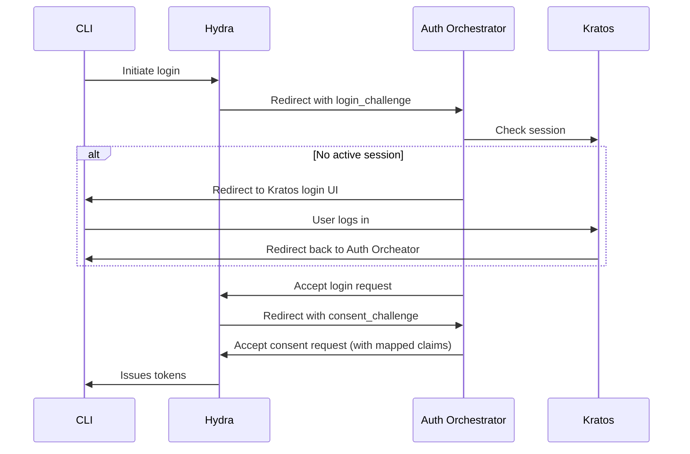
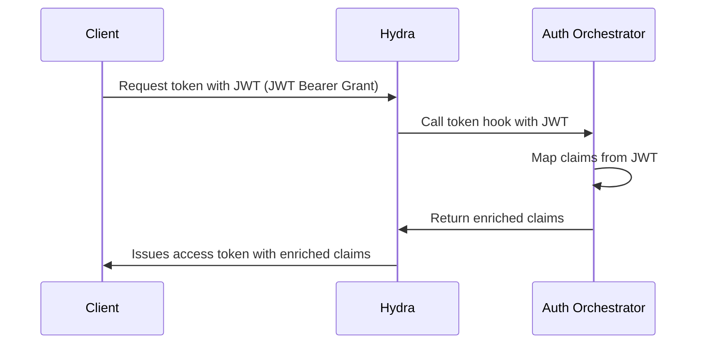

# Auth Orchestrator

> A lightweight service that orchestrates [Ory Kratos](https://www.ory.sh/docs/kratos) and [Ory Hydra](https://www.ory.sh/docs/hydra) to enable human (e.g. CLI) and machine-to-machine (M2M) authentication flows.

## Features

- **Kratos-Hydra Integration**: Acts as a bridge between Kratos and Hydra to enable OAuth2/OIDC flows (e.g. for CLIs) where Kratos is the identity provider.
- **Claims Mapping**: Maps claims from Kratos identity traits to Hydra's ID and access tokens using a flexible, CEL-based mapping engine.
- **Token Enrichment**: Provides a token hook for Hydra to enrich access tokens with claims from external JWTs, ideal for M2M authentication using the JWT Bearer Grant flow.
- **Prometheus Metrics**: Exposes Prometheus metrics for monitoring and observability.

## How it Works

The Auth Orchestrator implements Hydra's Login and Consent Provider APIs to integrate with Kratos.

### Human-facing Authentication (PKCE)



### Machine-to-Machine (M2M) Authentication



## Prerequisites

- An existing deployment of [Ory Kratos](https://www.ory.sh/docs/kratos/self-hosted/install)
- An existing deployment of [Ory Hydra](https://www.ory.sh/docs/hydra/self-hosted/install)

## Configuration

The service can be configured using a TOML file, environment variables (prefixed with `AUTH_`), or command-line flags.

**Configuration File:**

The service looks for a configuration file named `auth-orchestrator.toml` in the current directory. See `examples/auth-orchestrator.example.toml` for a complete example.

**Command-line Flags and Environment Variables:**

| Flag                       | Environment Variable           | Description                                     | Default                               |
| -------------------------- | ------------------------------ | ----------------------------------------------- | ------------------------------------- |
| `--server.addr`            | `AUTH_SERVER_ADDR`             | HTTP listen address                             | `:8080`                               |
| `--hydra.admin_url`        | `AUTH_HYDRA_ADMIN_URL`         | Hydra Admin API URL                             | `http://hydra-admin:4445`             |
| `--kratos.public_url`      | `AUTH_KRATOS_PUBLIC_URL`       | Kratos Public API URL                           | `http://kratos-public:4433`           |
| `--consent.remember_for`   | `AUTH_CONSENT_REMEMBER_FOR`    | Consent remember duration in seconds            | `300`                                 |
| `--consent.scopes`         | `AUTH_CONSENT_SCOPES`          | Default scopes to grant                         | `openid,offline`                      |
| `--consent.audience`       | `AUTH_CONSENT_AUDIENCE`        | Default access token audiences to grant         | `[]`                                  |
| `--mapping.path`           | `AUTH_MAPPING_PATH`            | Path to the claims mapping file                 | `/etc/auth/mapping.yaml`              |
| `--mapping.on_error`       | `AUTH_MAPPING_ON_ERROR`        | Behavior on mapping error (`deny` or `allow`)   | `deny`                                |
| `--mapping.merge_strategy` | `AUTH_MAPPING_MERGE_STRATEGY`  | How to merge mapped claims (`deep` or `shallow`) | `deep`                                |
| `--mapping.reload`         | `AUTH_MAPPING_RELOAD`          | Automatically reload mapping file on changes    | `true`                                |
| `--log.level`              | `AUTH_LOG_LEVEL`               | Log level (`debug`, `info`, `warn`, `error`)    | `info`                                |
| `--log.format`             | `AUTH_LOG_FORMAT`              | Log format (`text` or `json`)                   | `text`                                |
| `--log.add_source`         | `AUTH_LOG_ADD_SOURCE`          | Include source position in logs                 | `false`                               |
| `--tls.ca_file`            | `AUTH_TLS_CA_FILE`             | Path to a CA certificate file for TLS           | `""`                                 |
| `--tls.ca_pem`             | `AUTH_TLS_CA_PEM`              | CA certificate PEM block for TLS                | `""`                                 |

## Claims Mapping

The service uses a powerful mapping engine based on the [Common Expression Language (CEL)](https://github.com/google/cel-spec) to map claims.

The mapping configuration is defined in a YAML file (e.g., `mapping.yaml`).

### Consent Flow Mapping

This mapping is applied during the consent flow to map claims from the Kratos identity to the Hydra tokens.

**Example:**

```yaml
mappings:
  consent:
    requirements:
      - has(kratos.identity.traits.email)
      - has(kratos.identity.traits.domain)
    id_token:
      email: kratos.identity.traits.email
      domain: lower(kratos.identity.traits.domain) # Uses a custom 'lower' function
    access_token:
      ext:
        email: kratos.identity.traits.email
        domain: lower(kratos.identity.traits.domain)
```

### Token Hook Mapping

This mapping is applied by the token hook to enrich access tokens with claims from an external JWT. The mappings are scoped by the JWT's issuer (`iss` claim).

**Example for GitHub Actions OIDC Tokens:**

```yaml
mappings:
  token_hooks:
    "https://token.actions.githubusercontent.com":
      requirements:
        - has(jwt.repository)
        - has(jwt.ref)
        - has(jwt.sha)
      access_token:
        ext:
          gh_repository: jwt.repository
          gh_ref: jwt.ref
          gh_sha: jwt.sha
          gh_actor: jwt.actor
          gh_environment: jwt.environment
```

## Deployment

The service is a Go application that can be run as a standalone binary or in a Docker container.

### Hydra Configuration

You need to configure Hydra to use the Auth Orchestrator for login and consent, and for the token hook.

```bash
ory patch oauth2-config \
  --replace '/urls/login="https://auth.example.com/api/v1/oauth2/login"' \
  --replace '/urls/consent="https://auth.example.com/api/v1/oauth2/consent"' \
  --add '/oauth2/token_hook/url="https://auth.example.com/api/v1/hydra/token-hook"'
```

### Monitoring

- **Health Check**: `GET /healthz`
- **Prometheus Metrics**: `GET /api/v1/metrics`

## API

- `GET /api/v1/oauth2/login`: Handles Hydra `login_challenge`.
- `GET /api/v1/oauth2/consent`: Handles Hydra `consent_challenge`.
- `POST /api/v1/hydra/token-hook`: Enriches access tokens for JWT-Bearer grant types.

## Development

To run the service locally for development:

```bash
go run ./cmd/auth run
```

You can use environment variables to configure the service for your local setup:

```bash
AUTH_HYDRA_ADMIN_URL="http://localhost:4445" \
AUTH_KRATOS_PUBLIC_URL="http://localhost:4433" \
AUTH_MAPPING_PATH="./examples/mapping.example.yaml" \
go run ./cmd/auth run
```